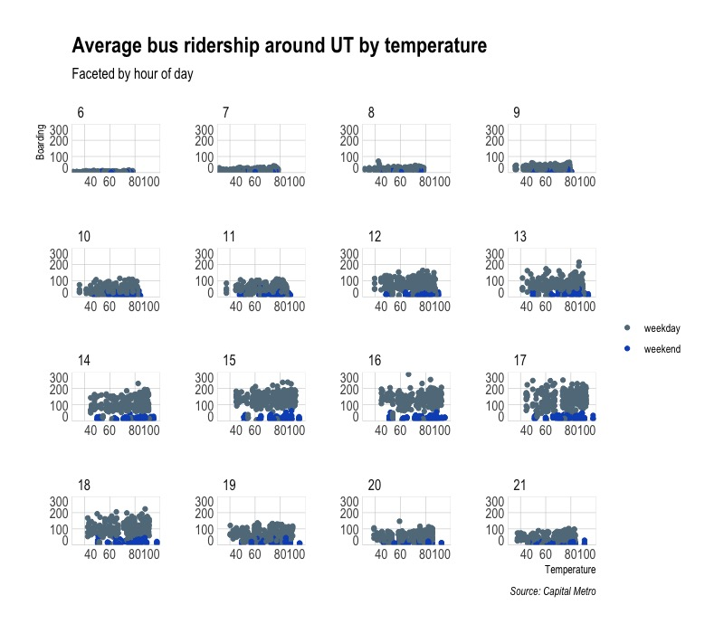

```{r setup, include=FALSE}
knitr::opts_chunk$set(echo = TRUE, 
                      cache = TRUE,
                      warning = FALSE, 
                      message = FALSE)

options(scipen = 999) 

library(tidyverse)
library(tidymodels)
library(tidyquant)
library(skimr)
library(estimatr)
library(ggthemes)
library(kknn)
library(glmnet)
library(lubridate)
library(scales)
library(patchwork)
library(hrbrthemes)
library(kableExtra)
library(gcookbook)
library(mosaic)
library(mosaicData)
```


```{r}
# funcs

read_data <- function(df) {
  #' read data from git url
  #' INPUT: data set name
  #' OUTPUT: dataframe
  full_path <- paste("https://raw.githubusercontent.com/jgscott/ECO395M/master/data/", 
                     df, sep = "")
  df <- read_csv(full_path)
  return(df)
}
```

## Visualization

```{r capmetro_import}

capmetro <- read_data("capmetro_UT.csv") %>%
    # recode categorical vars
    mutate(day_of_week = factor(day_of_week,
                                levels = c("Mon", "Tue", "Wed","Thu",
                                           "Fri","Sat","Sun")),
           month = factor(month, levels=c("Sep", "Oct","Nov")))

# skimr::skim(capmetro)
```

```{r}
p1 <- 
  capmetro %>%
    group_by(hour_of_day, day_of_week, month) %>%
    mutate(avg_boarding = mean(boarding)) %>%
    ungroup() %>%
    ggplot() +
    geom_line(aes(x = hour_of_day, y = avg_boarding, color = month)) +
    scale_x_continuous(expand = c(0,0), limits = c(0, 24), 
                       breaks = seq(10, 20, 5)) +
    scale_y_continuous(expand = c(0,0), limits = c(0, 160)) +
    scale_color_ft("Month") +
    facet_wrap(. ~ day_of_week, scales = "free") + 
    labs(x = "Hour of day", y = "Average boarding",
         title = "Average bus ridership around UT",
         subtitle = "Tracked by optical scanner",
         caption = "Source: Capital Metro") + 
    theme_ipsum(grid = "XY", axis = "xy") 

flush_ticks(p1)
```

This figure illustrates average CapMetro bus boardings (as tracked by optical scanner) through the weekdays in the months of September, October, and November.

The hour of peak boarding seems to stay relatively consistent. There slight bumps early in the day, but hour 17 (5pm) seems to be consistently higher. This makes sense because that is when most folks get out of work. We see this does not hold for weekends, supporting the hypothesis that these are work commutes. 

The first Monday of September is Labor Day. This is a holiday, so commutes are likely to be down. There are less holidays on WThF, so this seems robust to my first hypothesis.

```{r}
p2 <-
  capmetro %>%
    group_by(timestamp, hour_of_day) %>%
    mutate(avg_boarding = mean(boarding)) %>%
    ggplot() +
    geom_point(aes(x = temperature, y = avg_boarding, color = weekend)) +
    scale_x_continuous(expand = c(0,0), limits = c(30, 100), 
                       breaks = seq(40, 100, 20)) +
    scale_y_continuous(expand = c(0,0), limits = c(0, 300)) +
    scale_color_ft() +
    facet_wrap(. ~ hour_of_day, scales = "free") +  
    labs(x = "Temperature", y = "Boarding",
         title = "Average bus ridership around UT by temperature",
         subtitle = "Faceted by hour of day",
         caption = "Source: Capital Metro") + 
    theme_ipsum(grid = "XY", axis = "xy") +
    theme(legend.title = element_blank()) 

p2 <- flush_ticks(p2)
```



This figure shows average ridership, by temperature, faceted by hour -- 6am to 10pm -- of the day (averaged by 15-minute increments) and colored in gray for weekdays (M-F) and blue for weekends. 

Riders seem pretty inelastic to changes in temperature. Their demand for the bus seems relatively constant when holding all else fixed. Variation in bus demand seems to primarily a function of time-of-day and, I would conjecture, geographic location (Although we do not have data for this latter point).


## Saratoga House Prices

RMSE to beat: 66257.83.

```{r saratoga_import, cache=TRUE}
saratoga_houses <- mosaicData::SaratogaHouses

#skimr::skim(saratoga_houses)

# Histogtam of saratoga house prices
saratoga_houses %>%
  ggplot(aes(x = price)) +
  geom_histogram(bins = 50, fill = "dodgerblue", color = "black") + 
  labs(x="Price", y="Count",
     title="Distribution of Price",
     subtitle="Saratoga Houses",
     caption="Source: MosaicData") +
  theme_ipsum(grid="Y")
```

### Build Model

We start with a very simple model. The first step is to create the train/test split.

```{r saratoga_test_train, cache=TRUE}
set.seed(395)
saratoga_split <- initial_split(saratoga_houses, strata = "price", prop = 0.75)

saratoga_train <- training(saratoga_split)
saratoga_test  <- testing(saratoga_split)

dim(saratoga_train)
dim(saratoga_split)
```

Let's use cross-validation to split the training set into k-folds.

```{r, cache=TRUE}
# 3 fold cross validation (for speed)
saratoga_vfold <- vfold_cv(saratoga_train, v = 3, repeats = 1, strata = "price")
```

We are interested in two different models, a linear regression model and a knn regression model. We start by creating the model specifications.

```{r mod_spec, cache=TRUE}
lm_spec <-
    linear_reg() %>%
    set_mode("regression") %>%
    set_engine("lm")

lm_spec

knn_spec <-
  nearest_neighbor(
    mode = "regression",
    neighbors = tune("K"),
  ) %>%
  set_engine("kknn")

knn_spec
```

Next we put together a tidymodels `workflow()`:

```{r, cache=TRUE}
# feature engineering
saratoga_wf <-
  workflow() %>%
  add_formula(price ~ .) %>%
  # mean impute numeric variables
  step_meanimpute(all_numeric()) %>%
  # rescale all numeric variables to lie between 0 and 1
  step_range(all_numeric(), min = 0, max = 1) %>%
  # remove predictor variables that are almost the same for every entry
  step_nzv(all_predictors()) 

saratoga_wf
```

There is no model yet. Now we can add a model, and fit to the resamples.

```{r, cache=TRUE}
set.seed(350)
lm_rs <- 
  saratoga_wf %>%
  add_model(lm_spec) %>%
  fit_resamples(
    resamples = saratoga_vfold,
    control = control_resamples(save_pred = TRUE)
  )
```

Second, we can fit the KNN model. This one requires a bit more work.

```{r, cache=TRUE}
set.seed(350)
# feature engineering
knn_rec <- 
  recipe(price ~ ., data = saratoga_train) %>%
  # mean impute numeric variables
  step_meanimpute(all_numeric()) %>%
  # rescale all numeric variables to lie between 0 and 1
  step_range(all_numeric(), min = 0, max = 1) %>%
  # remove predictor variables that are almost the same for every entry
  step_nzv(all_predictors()) 

# workflow
knn_wf <- 
  workflow() %>%
  add_model(knn_spec) %>%
  add_recipe(knn_rec)

# hyperparametering tuning
gridvals <- tibble(K = seq(1, 200))

knn_rs <- 
  knn_wf %>%
  tune_grid(
    resamples = saratoga_vfold,
    grid = gridvals,
    control = control_resamples(save_pred = TRUE)
  ) 

knn_rs
```

Now we have fit each of the candidate models to the resampled training set. For the KNN regression, we take the *minimum* RMSE to find the best setting for the number of neighbors.

```{r, cache=TRUE}
set.seed(350)
# hyperparameter tuning
# show only the row of minimum RMSE
knn_min <- knn_rs %>%
  collect_metrics() %>% 
  filter(.metric == "rmse") %>%
  filter(mean == min(mean))
knn_min
```

### Evaluate Model

First, we evaluate the linear regression model.

```{r, cache=TRUE}
final_lm_wf <- 
  saratoga_wf %>%
  add_model(lm_spec) 
  
lm_fit <- 
  final_lm_wf %>%
  last_fit(split = saratoga_split)

lm_fit %>% collect_metrics()

lm_results <-
  lm_fit %>%
  collect_predictions()

# view results
lm_results
```

Here we see the `rmse` for the linear model. It is quite large but noticeably better than the provided script in class. Then, for the linear model, we can look at coefficient estimates.

```{r, cache=TRUE}
lm_fit$.workflow[[1]] %>% 
  tidy() %>% 
  kable(digits = 4, "pipe") 
```

And we can plot the results.

```{r, cache=TRUE}
lm_results %>%
  #unnest(.predictions) %>%
  ggplot(aes(.pred, price)) +
  geom_abline(lty = 2, color = "tomato", size = 1) +
  geom_point(alpha = 0.5, color = "dodgerblue") +
  labs(
    title = 'Linear Regression Results - Saratoga Test Set',
    x = "Truth",
    y = "Predicted price",
    color = NULL
  ) + 
  theme_ipsum()
```

Next, we evaluate the KNN model on out of sample data.

```{r, cache=TRUE}
final_knn_wf <- 
  knn_wf %>% 
  finalize_workflow(knn_min)

knn_fit <- 
  final_knn_wf %>% 
  last_fit(split = saratoga_split)

knn_fit %>% collect_metrics()

# predictions
knn_results <- 
  knn_fit %>% 
  collect_predictions()

# view results
knn_results
```

Above we see the model `rmse`, which is absurdly low. And we can plot the results.

```{r, cache=TRUE}
knn_results %>%
  #unnest(.predictions) %>%
  ggplot(aes(.pred, price)) +
  geom_abline(lty = 2, color = "tomato", size = 1) +
  geom_point(alpha = 0.5, color = "dodgerblue") +
  labs(
    title = 'KNN Regression Results - Saratoga Test Set',
    x = "Truth",
    y = "Predicted price",
    color = NULL
  ) + 
  theme_ipsum()
```

## Classification and retrospective sampling

```{r credit_import}
german_credit <- 
  read_data("german_credit.csv") %>% 
  select(-1) %>%
  # set outcome as factor 
  mutate(Default = as.factor(Default))
```

### Build logistic regression model

First, we create a bar-plot of the percentage of default by credit history.

```{r}
german_credit %>%
  group_by(Default, history) %>%
  add_tally() %>% 
  rename(num_default = n) %>% 
  distinct(history, num_default) %>%
  ungroup() %>%
  group_by(history) %>%
  mutate(tot_default = sum(num_default),
         prob_default = (num_default / tot_default) * 100) %>%
  filter(Default == 0) %>%
  ggplot() +
  geom_col(aes(x = history, y = prob_default, 
             fill = history)) + 
  scale_y_continuous(labels = function(x) paste0(x, "%")) +
  scale_x_discrete(labels = c("Good", "Poor", "Terrible")) +
  scale_fill_ft() +
  labs(x = "History", y = "Probability of Default",
       title = "Probability of credit default given credit history") +
  theme_ipsum(grid = "Y") + 
  theme(legend.title = element_blank(),
        legend.position = "None")
```

Next, we create the train/test splits.

```{r}
set.seed(395)
german_split <- initial_split(german_credit, strata = "Default", prop = 0.75)

german_train <- training(german_split)
german_test  <- testing(german_split)

# 3 fold cross validation (for speed)
german_vfold <- vfold_cv(german_train, v = 3, repeats = 1, strata = "Default")
german_vfold 
```

From the problem statement, we use the following features:

- `duration + amount + installment + age + history + purpose + foreign`

So the first step is to construct the model engine.

```{r}
log_spec <-
  logistic_reg(penalty = tune(), mixture = 1) %>% 
  set_engine("glmnet") %>% 
  set_mode("classification") 

log_spec
```

Next, we define a recipe and workflow.

```{r}
set.seed(350)

# varlist to keep
varlist <- c("Default", "duration", "amount", "installment", "age", 
             "history", "purpose", "foreign")

# recipe // feature engineering
log_rec <- 
  recipe(Default ~ ., data = german_train) %>%
  # remove vars not in varlist
  step_rm(setdiff(colnames(german_credit), varlist)) %>%
  step_dummy(all_nominal(), -all_outcomes()) %>% 
  step_zv(all_predictors()) %>% 
  step_normalize(all_predictors())
  
# workflow
log_wf <- 
  workflow() %>%
  add_model(log_spec) %>%
  add_recipe(log_rec)
```

There is no model yet. Now we can add a model, and fit to the resamples. First, we need to create the grid for tuning.

```{r}
log_grid <- tibble(penalty = 10^seq(-4, -1, length.out = 30))
```


```{r}
set.seed(350)

log_rs <- 
  log_wf %>% 
  tune_grid(german_vfold,
            grid = log_grid,
            control = control_grid(save_pred = TRUE),
            metrics = metric_set(roc_auc))

log_rs
```

We can look at the area under the ROC curve against the range of penalty values.

```{r}
log_rs %>% 
  collect_metrics() %>% 
  ggplot(aes(x = penalty, y = mean)) + 
  geom_point() + 
  geom_line() + 
  ylab("Area under the ROC Curve") +
  scale_x_log10(labels = scales::label_number()) + 
  theme_ipsum()
```

Here we see that model performance is typically better at smaller values. This indicates that the majority of predictors are important in this model. 

```{r}
top_models <-
  log_rs %>% 
  show_best("roc_auc", n = 20) %>% 
  arrange(penalty) 

top_models %>% kbl(format = "pipe", booktabs = T)
```

```{r}
log_rs %>%
  select_best()
```

It seems model 15 is our best choice. Let's look at an ROC plot.

```{r}
log_best <- 
  log_rs %>% 
  collect_metrics() %>% 
  arrange(penalty) %>% 
  slice(15)

log_auc <- 
  log_rs %>% 
  collect_predictions(parameters = log_best) %>% 
  roc_curve(Default, .pred_0) %>% 
  mutate(model = "Logistic Regression")

autoplot(log_auc)
```


```{r}
final_log_wf <- 
  log_wf %>% 
  finalize_workflow(log_best)

log_fit <- 
  final_log_wf %>% 
  last_fit(split = german_split)

log_fit %>% collect_metrics()

# predictions
log_results <- 
  log_fit %>% 
  collect_predictions()

# view results
log_results

# ROC curve
log_results %>% 
  roc_curve(Default, .pred_0) %>% 
  autoplot()
```

Next, we can look at a confusion matrix.

```{r}
cm <- log_results %>%
  conf_mat(Default, .pred_class)

cm
```

This model is accurate 74.4 percent of the time. That's not ideal. The null model of assuming no one will default would be correct 70 percent of the time (given the 700/300 split). These data are likely not ideal for predicting, as previous credit history carries so much weight. I would recommend the bank get a more balance sample. See the following:

```{r}
german_credit %>% 
  group_by(history) %>% 
  tally() %>%
  kbl(format = "pipe")
```

The skew is pretty strong and the sampling is not balanced.

## Children and Hotel Reservations

```{r hotels_dev_import}
hotels_dev <- 
  read_data("hotels_dev.csv") %>%
  mutate(children = as.factor(children))
```

First, we look at some proportions. How many stays included children?

```{r}
hotels_dev %>%
  count(children) %>%
  mutate(prop = round( n/sum(n), 3)) %>%
  mutate(children = if_else(children == 1, "children", "none")) %>%
  kbl("pipe")
```

In this sample, children only make up about 8% of the sample. This can be problematic. 

```{r}
hotel_splits <- initial_split(hotels_dev, strata = children)

hotel_train <- training(hotel_splits)
hotel_test <- testing(hotel_splits)

train_val_set <- validation_split(hotel_train, strata = children, prop = 0.8)
```

We can also look at the proportions in our train/test split.

```{r}
# train
hotel_train %>%
  count(children) %>%
  mutate(prop = round( n/sum(n), 3)) %>%
  mutate(children = if_else(children == 1, "children", "none")) %>%
  kbl("pipe")

# test
hotel_test %>%
  count(children) %>%
  mutate(prop = round( n/sum(n), 3)) %>%
  mutate(children = if_else(children == 1, "children", "none")) %>%
  kbl("pipe")
```

Here we see the splits are similar in proportion for children/no-children.

### Baseline models

Our first model will be a penalized logistic regression model since our variable of interest is categorical.

```{r}
log_mod_base1 <- 
  logistic_reg(penalty = tune(), mixture = 1) %>%
  set_engine("glmnet")
```

For the first model, we will only use the following variables: `market_segment`, `adults`,
`customer_type`, and `is_repeated_guest`. We start with feature engineering.

```{r}
# Preprocess recipe
log_mod_base1_recipe <-
  recipe(children ~ market_segment + adults + customer_type + is_repeated_guest,
         data = hotel_train) %>%
  step_dummy(all_nominal(), -all_outcomes()) %>%
  # remove vars with a single value
  step_zv(all_predictors()) %>%
  step_normalize(all_predictors())

# Preprocess
log_mod_base1_wrkflow <-
  workflow() %>%
  add_model(log_mod_base1) %>%
  add_recipe(log_mod_base1_recipe)
```

Now, we have to tune only one hyperparameter here.

```{r}
lr_reg_grid <- tibble(penalty = 10^seq(-4, -1, length.out = 30))

log_base1_res <- 
  log_mod_base1_wrkflow %>%
  tune_grid(train_val_set,
            grid = lr_reg_grid,
            control = control_grid(save_pred = T),
            metrics = metric_set(roc_auc))
```

```{r}
# select the best model
log_base1_res %>% 
  select_best()

best_mod_base1 <- 
  log_base1_res %>%
  collect_metrics() %>%
  slice(8)
```

```{r}
# roc curve
log_base1_res %>%
  collect_predictions(parameters = best_mod_base1) %>%
  roc_curve(children, .pred_0) %>% 
  mutate(model = "Logistic Regression") %>%
  autoplot() 
```

lol yikes! Let's show a confusion matrix:

```{r}
param_final <- 
  log_base1_res %>%
  select_best(metric = "roc_auc")

log_mod_base1_wrkflow <-
  log_mod_base1_wrkflow %>% 
  finalize_workflow(param_final)

base1_fit <- 
  log_mod_base1_wrkflow %>%
  last_fit(hotel_splits)

base1_pred <-
  base1_fit %>%
  collect_predictions()

base1_pred %>% 
  conf_mat(truth = children, estimate = .pred_class)
```

Okay now let's do the same thing but with all of the other predictors (except `arrival_date`).

Let's start with the feature engineering.

```{r}
# Preprocess recipe
holidays <- c("AllSouls", "AshWednesday", "ChristmasEve", "Easter", 
              "ChristmasDay", "GoodFriday", "NewYearsDay", "PalmSunday")

log_mod_base2_recipe <-
  recipe(children ~ .,
         data = hotel_train) %>%
  #step_downsample(children) %>%
  step_date(arrival_date) %>% 
  step_holiday(arrival_date, holidays = holidays) %>% 
  step_rm(arrival_date) %>% 
  step_dummy(all_nominal(), -all_outcomes()) %>%
  # remove vars with a single value
  step_zv(all_predictors()) %>%
  step_normalize(all_predictors())

# Preprocess
log_mod_base2_wrkflow <-
  workflow() %>%
  add_model(log_mod_base1) %>%
  add_recipe(log_mod_base2_recipe)
```

Again, we have to tune only one hyperparameter here.

```{r}
log_base2_res <- 
  log_mod_base2_wrkflow %>%
  tune_grid(train_val_set,
            grid = lr_reg_grid,
            control = control_grid(save_pred = T),
            metrics = metric_set(roc_auc))
```

Then we can plot the penalty values against the area under the ROC curve.

```{r}
log_base2_res %>% 
  collect_metrics() %>% 
  ggplot(aes(x = penalty, y = mean)) + 
  geom_point() + 
  geom_line() + 
  ylab("Area under the ROC Curve") +
  scale_x_log10(labels = scales::label_number()) + 
  theme_clean()
```

```{r}
# select the best model
log_base2_res %>% 
  select_best()

best_mod_base2 <- 
  log_base1_res %>%
  collect_metrics() %>%
  slice(12)
```

```{r}
# roc curve
log_base2_res %>%
  collect_predictions(parameters = best_mod_base2) %>%
  roc_curve(children, .pred_0) %>% 
  mutate(model = "Logistic Regression") %>%
  autoplot() 
```

This is not fabulous but it is quite a bit better than the first model. We can then look at confusion matrices.

```{r}
param_final <- 
  log_base2_res %>%
  select_best(metric = "roc_auc")

log_mod_base2_wrkflow <-
  log_mod_base2_wrkflow %>% 
  finalize_workflow(param_final)

base2_fit <- 
  log_mod_base2_wrkflow %>%
  last_fit(hotel_splits)

base2_pred <-
  base2_fit %>%
  collect_predictions()

base2_pred %>% 
  conf_mat(truth = children, estimate = .pred_class)
```

Now let's build a linear model using the `dev` dataset. We can use the same train/test splits as the previous models.

```{r, eval=FALSE}

# FIX THIS

# use feature engineering steps from above
prepped_hotel_train <- #hotel_train
  juice(prep(log_mod_base2_recipe))

# construct model
lin_model <- lm_robust(
  as.numeric(children) ~ .,
  data = prepped_hotel_train
)

lin_rec <-
  recipe(children ~ .,
         data = hotel_test) %>%
  #step_downsample(children) %>%
  step_date(arrival_date) %>% 
  step_holiday(arrival_date, holidays = holidays) %>% 
  step_rm(arrival_date) %>% 
  step_dummy(all_nominal(), -all_outcomes()) %>%
  # remove vars with a single value
  step_zv(all_predictors()) %>%
  step_normalize(all_predictors())

predict(lin_model, newdata = juice(prep(lin_rec)))
```


```{r hotels_val_import}
hotels_val <- read_data("hotels_val.csv") %>%
  mutate(children = as.factor(children))

# create v-folds
hotel_folds <- vfold_cv(hotels_val, v = 20)
```

Then we can fit the v-folds:

```{r}
hotel_fold_fit <- 
  log_mod_base2_wrkflow %>%
  #add_model(log_mod_base1) %>%
  fit_resamples(
    resamples = hotel_folds,
    control = control_resamples(save_pred = TRUE)
  )
```

Next, we sum up the predicted probabilities for all the bookings in the fold. This gives an estimate of the expected number of bookings with children for that fold.

```{r}
# predicted probabilites
pred_sums <- list()

for (i in 1:20) {
  pred_sums <-
    hotel_fold_fit$.predictions[[i]] %>%
    summarize(sum_pred = sum(as.numeric(.pred_class))) %>%
    pull(sum_pred) %>% 
    append(pred_sums)
}

# actual probs
actual_sums <- list()

for (i in 1:20) {
  actual_sums <-
    hotel_fold_fit$.predictions[[i]] %>%
    summarize(sum_actual = sum(as.numeric(children))) %>%
    pull(sum_actual) %>% 
    append(actual_sums)
}

# colnames
names <- tibble("Folds" = c("Actual", "Predicted"))

# join pred and actual
probs <-
  as.tibble(actual_sums, .name_repair = "unique") %>% 
  rbind(as.tibble(pred_sums, .name_repair = "unique")) 

# print as table with names
cbind(names, probs) %>%
  kable(col.names = 
          append("Folds", make.unique(c("Folds", rep("v", 21)), sep = "")[3:22]),
      caption = "Sum of probabilities")
```

We can also plot it to see it more visually. 

```{r}
tibble(fold = seq(1, 20, 1), 
       Actual = unlist(actual_sums), 
       Prediction = unlist(pred_sums)) %>%
  pivot_longer(!fold, names_to = "names", values_to = "vals") %>%
  ggplot() +
  geom_point(aes(x = fold, y = vals, color = names))  + 
  labs(x = "Fold", y = "Sum of probabilies") + 
  scale_x_continuous(breaks = seq(1, 20, 1)) +
  scale_color_brewer(palette = "Set1") + 
  theme_clean() + 
  theme(legend.title = element_blank())
```

This seems to do okay across folds! 

```{r}
mean_err <- sum(probs[1,] - probs[2,]) / 20

glue::glue("The average mean error is {mean_err}")
```


## Session Information 

```{r sysinfo}
sessionInfo()
```

