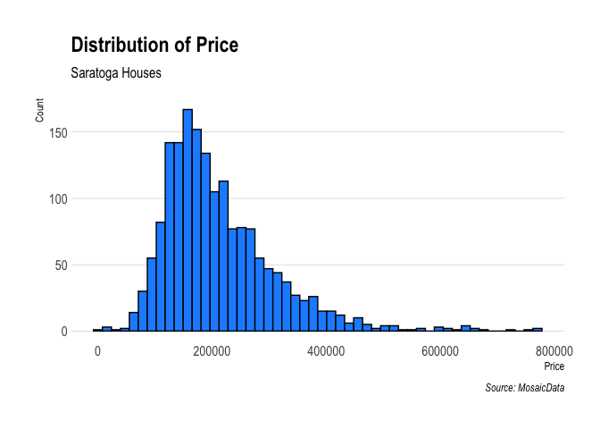
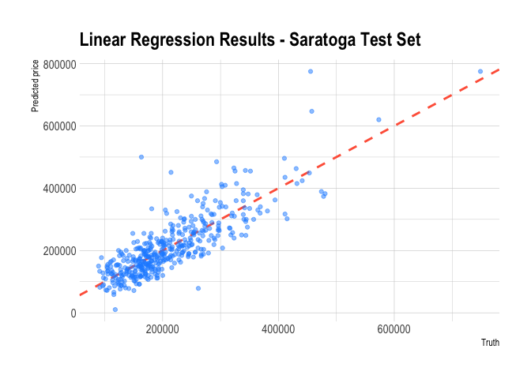
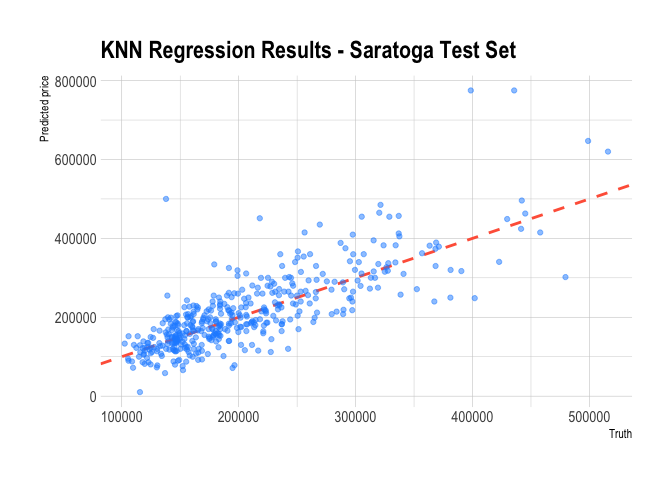

Exercise 02
================
Scott Cohn
Last compiled on 08 February, 2021

``` r
# funcs

read_data <- function(df) {
  #' read data from git url
  #' INPUT: data set name
  #' OUTPUT: dataframe
  full_path <- paste("https://raw.githubusercontent.com/jgscott/ECO395M/master/data/", 
                     df, sep = "")
  df <- read_csv(full_path)
  return(df)
}
```

## Visualization

``` r
# he hasn't uploaded data yet
capmetro <- read_data("capmetro_UT.csv") %>%
    # recode categorical vars
    mutate(day_of_week = factor(day_of_week,
                                levels = c("Mon", "Tue", "Wed","Thu",
                                           "Fri","Sat","Sun")),
           month = factor(month, levels=c("Sep", "Oct","Nov")))

#capmetro %>% colnames()
```

## Saratoga House Prices

``` r
saratoga_houses <- mosaicData::SaratogaHouses

# features
saratoga_houses %>% colnames()
```

    ##  [1] "price"           "lotSize"         "age"             "landValue"      
    ##  [5] "livingArea"      "pctCollege"      "bedrooms"        "fireplaces"     
    ##  [9] "bathrooms"       "rooms"           "heating"         "fuel"           
    ## [13] "sewer"           "waterfront"      "newConstruction" "centralAir"

``` r
# head
saratoga_houses %>% head()
```

    ##    price lotSize age landValue livingArea pctCollege bedrooms fireplaces
    ## 1 132500    0.09  42     50000        906         35        2          1
    ## 2 181115    0.92   0     22300       1953         51        3          0
    ## 3 109000    0.19 133      7300       1944         51        4          1
    ## 4 155000    0.41  13     18700       1944         51        3          1
    ## 5  86060    0.11   0     15000        840         51        2          0
    ## 6 120000    0.68  31     14000       1152         22        4          1
    ##   bathrooms rooms         heating     fuel             sewer waterfront
    ## 1       1.0     5        electric electric            septic         No
    ## 2       2.5     6 hot water/steam      gas            septic         No
    ## 3       1.0     8 hot water/steam      gas public/commercial         No
    ## 4       1.5     5         hot air      gas            septic         No
    ## 5       1.0     3         hot air      gas public/commercial         No
    ## 6       1.0     8         hot air      gas            septic         No
    ##   newConstruction centralAir
    ## 1              No         No
    ## 2              No         No
    ## 3              No         No
    ## 4              No         No
    ## 5             Yes        Yes
    ## 6              No         No

``` r
# Histogtam of saratoga house prices
saratoga_houses %>%
  ggplot(aes(x = price)) +
  geom_histogram(bins = 50, fill = "dodgerblue", color = "black") + 
  labs(x="Price", y="Count",
     title="Distribution of Price",
     subtitle="Saratoga Houses",
     caption="Source: MosaicData") +
  theme_ipsum(grid="Y")
```

<!-- -->

### Build Model

We start with a very simple model. The first step is to create the
train/test split.

``` r
set.seed(395)
saratoga_split <- initial_split(saratoga_houses, strata = "price", prop = 0.75)

saratoga_train <- training(saratoga_split)
saratoga_test  <- testing(saratoga_split)

dim(saratoga_train)
```

    ## [1] 1298   16

``` r
dim(saratoga_split)
```

    ##   analysis assessment          n          p 
    ##       1298        430       1728         16

Let’s use cross-validation to split the training set into k-folds.

``` r
# 3 fold cross validation (for speed)
saratoga_vfold <- vfold_cv(saratoga_train, v = 3, repeats = 1, strata = "price")
saratoga_vfold 
```

    ## #  3-fold cross-validation using stratification 
    ## # A tibble: 3 x 2
    ##   splits            id   
    ##   <list>            <chr>
    ## 1 <split [864/434]> Fold1
    ## 2 <split [866/432]> Fold2
    ## 3 <split [866/432]> Fold3

We are interested in two different models, a linear regression model and
a knn regression model. We start by creating the model specifications.

``` r
lm_spec <-
    linear_reg() %>%
    set_mode("regression") %>%
    set_engine("lm")

lm_spec
```

    ## Linear Regression Model Specification (regression)
    ## 
    ## Computational engine: lm

``` r
knn_spec <-
  nearest_neighbor(
    mode = "regression",
    neighbors = tune("K"),
  ) %>%
  set_engine("kknn")

knn_spec
```

    ## K-Nearest Neighbor Model Specification (regression)
    ## 
    ## Main Arguments:
    ##   neighbors = tune("K")
    ## 
    ## Computational engine: kknn

Next we put together a tidymodels `workflow()`:

``` r
saratoga_wf <-
  workflow() %>%
  add_formula(price ~ .)

saratoga_wf
```

    ## ══ Workflow ════════════════════════════════════════════════════════════════════
    ## Preprocessor: Formula
    ## Model: None
    ## 
    ## ── Preprocessor ────────────────────────────────────────────────────────────────
    ## price ~ .

There is no model yet. Now we can add a model, and fit to the resamples.

``` r
set.seed(350)
lm_rs <- 
  saratoga_wf %>%
  add_model(lm_spec) %>%
  fit_resamples(
    resamples = saratoga_vfold,
    control = control_resamples(save_pred = TRUE)
  )
```

    ## 
    ## Attaching package: 'rlang'

    ## The following objects are masked from 'package:purrr':
    ## 
    ##     %@%, as_function, flatten, flatten_chr, flatten_dbl, flatten_int,
    ##     flatten_lgl, flatten_raw, invoke, list_along, modify, prepend,
    ##     splice

    ## 
    ## Attaching package: 'vctrs'

    ## The following object is masked from 'package:dplyr':
    ## 
    ##     data_frame

    ## The following object is masked from 'package:tibble':
    ## 
    ##     data_frame

``` r
lm_rs
```

    ## # Resampling results
    ## # 3-fold cross-validation using stratification 
    ## # A tibble: 3 x 5
    ##   splits            id    .metrics         .notes           .predictions      
    ##   <list>            <chr> <list>           <list>           <list>            
    ## 1 <split [864/434]> Fold1 <tibble [2 × 4]> <tibble [0 × 1]> <tibble [434 × 4]>
    ## 2 <split [866/432]> Fold2 <tibble [2 × 4]> <tibble [0 × 1]> <tibble [432 × 4]>
    ## 3 <split [866/432]> Fold3 <tibble [2 × 4]> <tibble [0 × 1]> <tibble [432 × 4]>

Second, we can fit the knn model. This one requires a bit more work.

``` r
set.seed(350)
# feature engineering
knn_rec <- 
  recipe(price ~ ., data = saratoga_train)

# workflow
knn_wf <- 
  workflow() %>%
  add_model(knn_spec) %>%
  add_recipe(knn_rec)

gridvals <- tibble(K = seq(1, 200))

knn_rs <- 
  knn_wf %>%
  tune_grid(
    resamples = saratoga_vfold,
    grid = gridvals,
    control = control_resamples(save_pred = TRUE)
  ) 

knn_rs
```

    ## # Tuning results
    ## # 3-fold cross-validation using stratification 
    ## # A tibble: 3 x 5
    ##   splits            id    .metrics          .notes          .predictions        
    ##   <list>            <chr> <list>            <list>          <list>              
    ## 1 <split [864/434]> Fold1 <tibble [400 × 5… <tibble [0 × 1… <tibble [86,800 × 5…
    ## 2 <split [866/432]> Fold2 <tibble [400 × 5… <tibble [0 × 1… <tibble [86,400 × 5…
    ## 3 <split [866/432]> Fold3 <tibble [400 × 5… <tibble [0 × 1… <tibble [86,400 × 5…

Now we have fit each of the candidate models to the resampled training
set. For the knn regression, we take the *minimum* RMSE to find the best
setting for the number of neighbors.

``` r
set.seed(350)
# show only the row of minimum RMSE
knn_min <- knn_rs %>%
  collect_metrics() %>% 
  filter(.metric == "rmse") %>%
  filter(mean == min(mean))
knn_min
```

    ## # A tibble: 1 x 7
    ##       K .metric .estimator   mean     n std_err .config               
    ##   <int> <chr>   <chr>       <dbl> <int>   <dbl> <chr>                 
    ## 1    18 rmse    standard   62007.     3   1210. Preprocessor1_Model018

### Evaluate Model

First, we evaluate the linear regression model.

``` r
final_lm_wf <- 
  saratoga_wf %>%
  add_model(lm_spec) 
  
lm_fit <- 
  final_lm_wf %>%
  last_fit(split = saratoga_split)

lm_fit %>% collect_metrics()
```

    ## # A tibble: 2 x 4
    ##   .metric .estimator .estimate .config             
    ##   <chr>   <chr>          <dbl> <chr>               
    ## 1 rmse    standard   54702.    Preprocessor1_Model1
    ## 2 rsq     standard       0.698 Preprocessor1_Model1

``` r
lm_results <-
  lm_fit %>%
  collect_predictions()

# view results
lm_results
```

    ## # A tibble: 430 x 5
    ##    id                 .pred  .row  price .config             
    ##    <chr>              <dbl> <int>  <int> <chr>               
    ##  1 train/test split 224742.    11 325000 Preprocessor1_Model1
    ##  2 train/test split 200103.    12 120000 Preprocessor1_Model1
    ##  3 train/test split 128863.    20  87500 Preprocessor1_Model1
    ##  4 train/test split 119169.    21 112000 Preprocessor1_Model1
    ##  5 train/test split 342865.    29 457000 Preprocessor1_Model1
    ##  6 train/test split 199509.    34 227000 Preprocessor1_Model1
    ##  7 train/test split 228159.    36 169900 Preprocessor1_Model1
    ##  8 train/test split 174841.    43 150000 Preprocessor1_Model1
    ##  9 train/test split 261218.    44 234900 Preprocessor1_Model1
    ## 10 train/test split 296332.    45 279550 Preprocessor1_Model1
    ## # … with 420 more rows

For the linear model, we can look at coefficient estimates.

``` r
lm_fit$.workflow[[1]] %>% 
  tidy() %>% 
  kable(digits = 4, "pipe") 
```

| term                     |     estimate |  std.error | statistic | p.value |
|:-------------------------|-------------:|-----------:|----------:|--------:|
| (Intercept)              |  110452.4327 | 22076.2147 |    5.0032 |  0.0000 |
| lotSize                  |    6587.1637 |  2451.0359 |    2.6875 |  0.0073 |
| age                      |    -137.9241 |    67.0579 |   -2.0568 |  0.0399 |
| landValue                |       0.8981 |     0.0571 |   15.7178 |  0.0000 |
| livingArea               |      71.1150 |     5.5151 |   12.8947 |  0.0000 |
| pctCollege               |    -190.1991 |   177.2926 |   -1.0728 |  0.2836 |
| bedrooms                 |   -9022.9369 |  3052.7430 |   -2.9557 |  0.0032 |
| fireplaces               |    1626.0094 |  3483.2193 |    0.4668 |  0.6407 |
| bathrooms                |   23343.1081 |  4001.0320 |    5.8343 |  0.0000 |
| rooms                    |    3050.6021 |  1135.2484 |    2.6872 |  0.0073 |
| `heatinghot water/steam` |   -9791.4192 |  5014.3886 |   -1.9527 |  0.0511 |
| heatingelectric          |   -7016.1982 | 14930.4825 |   -0.4699 |  0.6385 |
| fuelelectric             |   -2981.2484 | 14813.5136 |   -0.2013 |  0.8405 |
| fueloil                  |   -8032.3326 |  5838.9342 |   -1.3757 |  0.1692 |
| `sewerpublic/commercial` |     -53.9954 |  4326.0363 |   -0.0125 |  0.9900 |
| sewernone                |    2123.0469 | 19226.6824 |    0.1104 |  0.9121 |
| waterfrontNo             | -112238.8294 | 16996.2006 |   -6.6038 |  0.0000 |
| newConstructionNo        |   43133.2298 |  8502.7876 |    5.0728 |  0.0000 |
| centralAirNo             |  -10904.7657 |  4090.0701 |   -2.6662 |  0.0078 |

And we can plot the results.

``` r
lm_results %>%
  #unnest(.predictions) %>%
  ggplot(aes(.pred, price)) +
  geom_abline(lty = 2, color = "tomato", size = 1) +
  geom_point(alpha = 0.5, color = "dodgerblue") +
  labs(
    title = 'Linear Regression Results - Saratoga Test Set',
    x = "Truth",
    y = "Predicted price",
    color = NULL
  ) + 
  theme_ipsum()
```

<!-- -->

Next, we evaluate the KNN model.

``` r
final_knn_wf <- 
  knn_wf %>% 
  finalize_workflow(knn_min)

knn_fit <- 
  final_knn_wf %>% 
  last_fit(split = saratoga_split)

knn_fit %>% collect_metrics()
```

    ## # A tibble: 2 x 4
    ##   .metric .estimator .estimate .config             
    ##   <chr>   <chr>          <dbl> <chr>               
    ## 1 rmse    standard   60649.    Preprocessor1_Model1
    ## 2 rsq     standard       0.635 Preprocessor1_Model1

``` r
# predictions
knn_results <- 
  knn_fit %>% 
  collect_predictions()

# view results
knn_results
```

    ## # A tibble: 430 x 5
    ##    id                 .pred  .row  price .config             
    ##    <chr>              <dbl> <int>  <int> <chr>               
    ##  1 train/test split 191651.    11 325000 Preprocessor1_Model1
    ##  2 train/test split 165831.    12 120000 Preprocessor1_Model1
    ##  3 train/test split 155146.    20  87500 Preprocessor1_Model1
    ##  4 train/test split 157185.    21 112000 Preprocessor1_Model1
    ##  5 train/test split 336896.    29 457000 Preprocessor1_Model1
    ##  6 train/test split 157869.    34 227000 Preprocessor1_Model1
    ##  7 train/test split 251174.    36 169900 Preprocessor1_Model1
    ##  8 train/test split 178011.    43 150000 Preprocessor1_Model1
    ##  9 train/test split 246459.    44 234900 Preprocessor1_Model1
    ## 10 train/test split 304254.    45 279550 Preprocessor1_Model1
    ## # … with 420 more rows

And we can plot the results.

``` r
knn_results %>%
  #unnest(.predictions) %>%
  ggplot(aes(.pred, price)) +
  geom_abline(lty = 2, color = "tomato", size = 1) +
  geom_point(alpha = 0.5, color = "dodgerblue") +
  labs(
    title = 'KNN Regression Results - Saratoga Test Set',
    x = "Truth",
    y = "Predicted price",
    color = NULL
  ) + 
  theme_ipsum()
```

<!-- -->

## Classification and retrospective sampling

## Children and Hotel Reservations

## Session Information

``` r
sessionInfo()
```

    ## R version 4.0.3 (2020-10-10)
    ## Platform: x86_64-apple-darwin17.0 (64-bit)
    ## Running under: macOS Big Sur 10.16
    ## 
    ## Matrix products: default
    ## BLAS:   /Library/Frameworks/R.framework/Versions/4.0/Resources/lib/libRblas.dylib
    ## LAPACK: /Library/Frameworks/R.framework/Versions/4.0/Resources/lib/libRlapack.dylib
    ## 
    ## locale:
    ## [1] en_US.UTF-8/en_US.UTF-8/en_US.UTF-8/C/en_US.UTF-8/en_US.UTF-8
    ## 
    ## attached base packages:
    ## [1] stats     graphics  grDevices utils     datasets  methods   base     
    ## 
    ## other attached packages:
    ##  [1] vctrs_0.3.4                rlang_0.4.10              
    ##  [3] mosaic_1.8.2               ggridges_0.5.2            
    ##  [5] mosaicData_0.18.0          ggformula_0.9.4           
    ##  [7] ggstance_0.3.4             Matrix_1.2-18             
    ##  [9] lattice_0.20-41            gcookbook_2.0             
    ## [11] kableExtra_1.2.1           hrbrthemes_0.8.0          
    ## [13] patchwork_1.1.1            kknn_1.3.1                
    ## [15] tidyquant_1.0.2            quantmod_0.4.18           
    ## [17] TTR_0.24.2                 PerformanceAnalytics_2.0.4
    ## [19] xts_0.12-0                 zoo_1.8-8                 
    ## [21] lubridate_1.7.8            yardstick_0.0.7           
    ## [23] workflows_0.2.1            tune_0.1.2                
    ## [25] rsample_0.0.8              recipes_0.1.15            
    ## [27] parsnip_0.1.5              modeldata_0.1.0           
    ## [29] infer_0.5.4                dials_0.0.9               
    ## [31] scales_1.1.1               broom_0.7.3               
    ## [33] tidymodels_0.1.2           forcats_0.5.0             
    ## [35] stringr_1.4.0              dplyr_1.0.2               
    ## [37] purrr_0.3.4                readr_1.3.1               
    ## [39] tidyr_1.1.2                tibble_3.0.5              
    ## [41] ggplot2_3.3.3              tidyverse_1.3.0           
    ## 
    ## loaded via a namespace (and not attached):
    ##   [1] readxl_1.3.1       backports_1.1.6    systemfonts_0.3.2 
    ##   [4] tidytext_0.2.5     plyr_1.8.6         igraph_1.2.6      
    ##   [7] splines_4.0.3      crosstalk_1.1.0.1  leaflet_2.0.3     
    ##  [10] listenv_0.8.0      SnowballC_0.7.0    digest_0.6.27     
    ##  [13] foreach_1.5.0      htmltools_0.4.0    fansi_0.4.1       
    ##  [16] magrittr_2.0.1     mosaicCore_0.8.0   globals_0.14.0    
    ##  [19] modelr_0.1.7       gower_0.2.2        extrafont_0.17    
    ##  [22] wordcloud_2.6      extrafontdb_1.0    hardhat_0.1.5     
    ##  [25] colorspace_1.4-1   ggrepel_0.9.1      blob_1.2.1        
    ##  [28] rvest_0.3.6        haven_2.2.0        xfun_0.17         
    ##  [31] crayon_1.3.4       jsonlite_1.7.1     survival_3.2-7    
    ##  [34] iterators_1.0.12   glue_1.4.2         polyclip_1.10-0   
    ##  [37] gtable_0.3.0       ipred_0.9-9        webshot_0.5.2     
    ##  [40] Quandl_2.10.0      Rttf2pt1_1.3.8     DBI_1.1.0         
    ##  [43] Rcpp_1.0.4.6       viridisLite_0.3.0  GPfit_1.0-8       
    ##  [46] statquotes_0.2.2   lava_1.6.8.1       prodlim_2019.11.13
    ##  [49] htmlwidgets_1.5.1  httr_1.4.2         RColorBrewer_1.1-2
    ##  [52] ellipsis_0.3.1     farver_2.0.3       pkgconfig_2.0.3   
    ##  [55] nnet_7.3-14        dbplyr_1.4.4       tidyselect_1.1.0  
    ##  [58] DiceDesign_1.8-1   munsell_0.5.0      cellranger_1.1.0  
    ##  [61] tools_4.0.3        cli_2.2.0          generics_0.1.0    
    ##  [64] ggdendro_0.1-20    evaluate_0.14      yaml_2.2.1        
    ##  [67] knitr_1.30         fs_1.4.1           future_1.21.0     
    ##  [70] xml2_1.3.2         tokenizers_0.2.1   compiler_4.0.3    
    ##  [73] rstudioapi_0.13    curl_4.3           reprex_0.3.0      
    ##  [76] tweenr_1.0.1       lhs_1.1.1          stringi_1.5.3     
    ##  [79] highr_0.8          gdtools_0.2.2      pillar_1.4.4      
    ##  [82] lifecycle_0.2.0    furrr_0.2.1        R6_2.4.1          
    ##  [85] gridExtra_2.3      janeaustenr_0.1.5  parallelly_1.23.0 
    ##  [88] codetools_0.2-16   MASS_7.3-53        assertthat_0.2.1  
    ##  [91] withr_2.2.0        parallel_4.0.3     hms_0.5.3         
    ##  [94] quadprog_1.5-8     grid_4.0.3         rpart_4.1-15      
    ##  [97] timeDate_3043.102  class_7.3-17       rmarkdown_2.5     
    ## [100] ggforce_0.3.1      pROC_1.17.0.1
