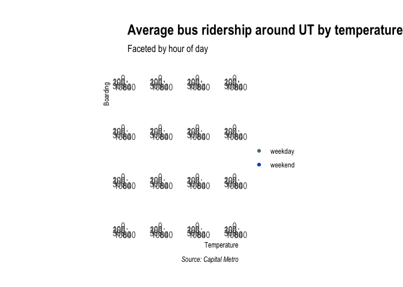
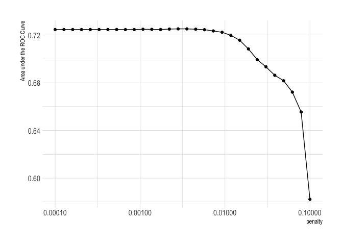

Exercise 02
================
Scott Cohn
Last compiled on 03 March, 2021

``` r
# funcs

read_data <- function(df) {
  #' read data from git url
  #' INPUT: data set name
  #' OUTPUT: dataframe
  full_path <- paste("https://raw.githubusercontent.com/jgscott/ECO395M/master/data/", 
                     df, sep = "")
  df <- read_csv(full_path)
  return(df)
}
```

## Visualization

``` r
capmetro <- read_data("capmetro_UT.csv") %>%
    # recode categorical vars
    mutate(day_of_week = factor(day_of_week,
                                levels = c("Mon", "Tue", "Wed","Thu",
                                           "Fri","Sat","Sun")),
           month = factor(month, levels=c("Sep", "Oct","Nov")))

skimr::skim(capmetro)
```

<table style="width: auto;" class="table table-condensed">
<caption>
Data summary
</caption>
<thead>
<tr>
<th style="text-align:left;">
</th>
<th style="text-align:left;">
</th>
</tr>
</thead>
<tbody>
<tr>
<td style="text-align:left;">
Name
</td>
<td style="text-align:left;">
capmetro
</td>
</tr>
<tr>
<td style="text-align:left;">
Number of rows
</td>
<td style="text-align:left;">
5824
</td>
</tr>
<tr>
<td style="text-align:left;">
Number of columns
</td>
<td style="text-align:left;">
8
</td>
</tr>
<tr>
<td style="text-align:left;">
\_\_\_\_\_\_\_\_\_\_\_\_\_\_\_\_\_\_\_\_\_\_\_
</td>
<td style="text-align:left;">
</td>
</tr>
<tr>
<td style="text-align:left;">
Column type frequency:
</td>
<td style="text-align:left;">
</td>
</tr>
<tr>
<td style="text-align:left;">
character
</td>
<td style="text-align:left;">
1
</td>
</tr>
<tr>
<td style="text-align:left;">
factor
</td>
<td style="text-align:left;">
2
</td>
</tr>
<tr>
<td style="text-align:left;">
numeric
</td>
<td style="text-align:left;">
4
</td>
</tr>
<tr>
<td style="text-align:left;">
POSIXct
</td>
<td style="text-align:left;">
1
</td>
</tr>
<tr>
<td style="text-align:left;">
\_\_\_\_\_\_\_\_\_\_\_\_\_\_\_\_\_\_\_\_\_\_\_\_
</td>
<td style="text-align:left;">
</td>
</tr>
<tr>
<td style="text-align:left;">
Group variables
</td>
<td style="text-align:left;">
None
</td>
</tr>
</tbody>
</table>

**Variable type: character**

<table>
<thead>
<tr>
<th style="text-align:left;">
skim\_variable
</th>
<th style="text-align:right;">
n\_missing
</th>
<th style="text-align:right;">
complete\_rate
</th>
<th style="text-align:right;">
min
</th>
<th style="text-align:right;">
max
</th>
<th style="text-align:right;">
empty
</th>
<th style="text-align:right;">
n\_unique
</th>
<th style="text-align:right;">
whitespace
</th>
</tr>
</thead>
<tbody>
<tr>
<td style="text-align:left;">
weekend
</td>
<td style="text-align:right;">
0
</td>
<td style="text-align:right;">
1
</td>
<td style="text-align:right;">
7
</td>
<td style="text-align:right;">
7
</td>
<td style="text-align:right;">
0
</td>
<td style="text-align:right;">
2
</td>
<td style="text-align:right;">
0
</td>
</tr>
</tbody>
</table>

**Variable type: factor**

<table>
<thead>
<tr>
<th style="text-align:left;">
skim\_variable
</th>
<th style="text-align:right;">
n\_missing
</th>
<th style="text-align:right;">
complete\_rate
</th>
<th style="text-align:left;">
ordered
</th>
<th style="text-align:right;">
n\_unique
</th>
<th style="text-align:left;">
top\_counts
</th>
</tr>
</thead>
<tbody>
<tr>
<td style="text-align:left;">
day\_of\_week
</td>
<td style="text-align:right;">
0
</td>
<td style="text-align:right;">
1
</td>
<td style="text-align:left;">
FALSE
</td>
<td style="text-align:right;">
7
</td>
<td style="text-align:left;">
Mon: 832, Tue: 832, Wed: 832, Thu: 832
</td>
</tr>
<tr>
<td style="text-align:left;">
month
</td>
<td style="text-align:right;">
0
</td>
<td style="text-align:right;">
1
</td>
<td style="text-align:left;">
FALSE
</td>
<td style="text-align:right;">
3
</td>
<td style="text-align:left;">
Oct: 1984, Sep: 1920, Nov: 1920
</td>
</tr>
</tbody>
</table>

**Variable type: numeric**

<table>
<thead>
<tr>
<th style="text-align:left;">
skim\_variable
</th>
<th style="text-align:right;">
n\_missing
</th>
<th style="text-align:right;">
complete\_rate
</th>
<th style="text-align:right;">
mean
</th>
<th style="text-align:right;">
sd
</th>
<th style="text-align:right;">
p0
</th>
<th style="text-align:right;">
p25
</th>
<th style="text-align:right;">
p50
</th>
<th style="text-align:right;">
p75
</th>
<th style="text-align:right;">
p100
</th>
<th style="text-align:left;">
hist
</th>
</tr>
</thead>
<tbody>
<tr>
<td style="text-align:left;">
boarding
</td>
<td style="text-align:right;">
0
</td>
<td style="text-align:right;">
1
</td>
<td style="text-align:right;">
51.51
</td>
<td style="text-align:right;">
48.82
</td>
<td style="text-align:right;">
0.00
</td>
<td style="text-align:right;">
13.00
</td>
<td style="text-align:right;">
33.00
</td>
<td style="text-align:right;">
79.25
</td>
<td style="text-align:right;">
288.00
</td>
<td style="text-align:left;">
▇▃▁▁▁
</td>
</tr>
<tr>
<td style="text-align:left;">
alighting
</td>
<td style="text-align:right;">
0
</td>
<td style="text-align:right;">
1
</td>
<td style="text-align:right;">
47.65
</td>
<td style="text-align:right;">
50.07
</td>
<td style="text-align:right;">
0.00
</td>
<td style="text-align:right;">
13.00
</td>
<td style="text-align:right;">
28.00
</td>
<td style="text-align:right;">
64.00
</td>
<td style="text-align:right;">
304.00
</td>
<td style="text-align:left;">
▇▂▁▁▁
</td>
</tr>
<tr>
<td style="text-align:left;">
temperature
</td>
<td style="text-align:right;">
0
</td>
<td style="text-align:right;">
1
</td>
<td style="text-align:right;">
69.28
</td>
<td style="text-align:right;">
13.54
</td>
<td style="text-align:right;">
29.18
</td>
<td style="text-align:right;">
59.20
</td>
<td style="text-align:right;">
72.75
</td>
<td style="text-align:right;">
79.29
</td>
<td style="text-align:right;">
97.64
</td>
<td style="text-align:left;">
▁▃▅▇▂
</td>
</tr>
<tr>
<td style="text-align:left;">
hour\_of\_day
</td>
<td style="text-align:right;">
0
</td>
<td style="text-align:right;">
1
</td>
<td style="text-align:right;">
13.50
</td>
<td style="text-align:right;">
4.61
</td>
<td style="text-align:right;">
6.00
</td>
<td style="text-align:right;">
9.75
</td>
<td style="text-align:right;">
13.50
</td>
<td style="text-align:right;">
17.25
</td>
<td style="text-align:right;">
21.00
</td>
<td style="text-align:left;">
▇▆▆▆▆
</td>
</tr>
</tbody>
</table>

**Variable type: POSIXct**

<table>
<thead>
<tr>
<th style="text-align:left;">
skim\_variable
</th>
<th style="text-align:right;">
n\_missing
</th>
<th style="text-align:right;">
complete\_rate
</th>
<th style="text-align:left;">
min
</th>
<th style="text-align:left;">
max
</th>
<th style="text-align:left;">
median
</th>
<th style="text-align:right;">
n\_unique
</th>
</tr>
</thead>
<tbody>
<tr>
<td style="text-align:left;">
timestamp
</td>
<td style="text-align:right;">
0
</td>
<td style="text-align:right;">
1
</td>
<td style="text-align:left;">
2018-09-01 06:00:00
</td>
<td style="text-align:left;">
2018-11-30 21:45:00
</td>
<td style="text-align:left;">
2018-10-16 13:52:30
</td>
<td style="text-align:right;">
5824
</td>
</tr>
</tbody>
</table>

``` r
p1 <- 
  capmetro %>%
    group_by(hour_of_day, day_of_week, month) %>%
    mutate(avg_boarding = mean(boarding)) %>%
    ungroup() %>%
    ggplot() +
    geom_line(aes(x = hour_of_day, y = avg_boarding, color = month)) +
    scale_x_continuous(expand = c(0,0), limits = c(0, 24), 
                       breaks = seq(10, 20, 5)) +
    scale_y_continuous(expand = c(0,0), limits = c(0, 160)) +
    scale_color_ft("Month") +
    facet_wrap(. ~ day_of_week, scales = "free") + 
    labs(x = "Hour of day", y = "Average boarding",
         title = "Average bus ridership around UT",
         subtitle = "Tracked by optical scanner",
         caption = "Source: Capital Metro") + 
    theme_ipsum(grid = "XY", axis = "xy") 

flush_ticks(p1)
```

    ## theme(axis.text.x=element_text(hjust=c(0, rep(0.5, 1), 1))) +
    ## theme(axis.text.y=element_text(vjust=c(0, rep(0.5, 3), 1)))

<!-- -->

ADD DESCRIPTION

``` r
p2 <-
  capmetro %>%
    group_by(timestamp, hour_of_day) %>%
    mutate(avg_boarding = mean(boarding)) %>%
    ggplot() +
    geom_point(aes(x = temperature, y = avg_boarding, color = weekend)) +
    scale_x_continuous(expand = c(0,0), limits = c(30, 100), 
                       breaks = seq(40, 100, 20)) +
    scale_y_continuous(expand = c(0,0), limits = c(0, 300)) +
    scale_color_ft() +
    facet_wrap(. ~ hour_of_day, scales = "free") +  
    labs(x = "Temperature", y = "Boarding",
         title = "Average bus ridership around UT by temperature",
         subtitle = "Faceted by hour of day",
         caption = "Source: Capital Metro") + 
    theme_ipsum(grid = "XY", axis = "xy") +
    theme(legend.title = element_blank()) 

flush_ticks(p2)
```

    ## theme(axis.text.x=element_text(hjust=c(0, rep(0.5, 2), 1))) +
    ## theme(axis.text.y=element_text(vjust=c(0, rep(0.5, 2), 1)))

<!-- -->

ADD DESCRIPTION

## Saratoga House Prices

RMSE to beat: 66257.83.

``` r
saratoga_houses <- mosaicData::SaratogaHouses

skimr::skim(saratoga_houses)
```

<table style="width: auto;" class="table table-condensed">
<caption>
Data summary
</caption>
<thead>
<tr>
<th style="text-align:left;">
</th>
<th style="text-align:left;">
</th>
</tr>
</thead>
<tbody>
<tr>
<td style="text-align:left;">
Name
</td>
<td style="text-align:left;">
saratoga\_houses
</td>
</tr>
<tr>
<td style="text-align:left;">
Number of rows
</td>
<td style="text-align:left;">
1728
</td>
</tr>
<tr>
<td style="text-align:left;">
Number of columns
</td>
<td style="text-align:left;">
16
</td>
</tr>
<tr>
<td style="text-align:left;">
\_\_\_\_\_\_\_\_\_\_\_\_\_\_\_\_\_\_\_\_\_\_\_
</td>
<td style="text-align:left;">
</td>
</tr>
<tr>
<td style="text-align:left;">
Column type frequency:
</td>
<td style="text-align:left;">
</td>
</tr>
<tr>
<td style="text-align:left;">
factor
</td>
<td style="text-align:left;">
6
</td>
</tr>
<tr>
<td style="text-align:left;">
numeric
</td>
<td style="text-align:left;">
10
</td>
</tr>
<tr>
<td style="text-align:left;">
\_\_\_\_\_\_\_\_\_\_\_\_\_\_\_\_\_\_\_\_\_\_\_\_
</td>
<td style="text-align:left;">
</td>
</tr>
<tr>
<td style="text-align:left;">
Group variables
</td>
<td style="text-align:left;">
None
</td>
</tr>
</tbody>
</table>

**Variable type: factor**

<table>
<thead>
<tr>
<th style="text-align:left;">
skim\_variable
</th>
<th style="text-align:right;">
n\_missing
</th>
<th style="text-align:right;">
complete\_rate
</th>
<th style="text-align:left;">
ordered
</th>
<th style="text-align:right;">
n\_unique
</th>
<th style="text-align:left;">
top\_counts
</th>
</tr>
</thead>
<tbody>
<tr>
<td style="text-align:left;">
heating
</td>
<td style="text-align:right;">
0
</td>
<td style="text-align:right;">
1
</td>
<td style="text-align:left;">
FALSE
</td>
<td style="text-align:right;">
3
</td>
<td style="text-align:left;">
hot: 1121, ele: 305, hot: 302
</td>
</tr>
<tr>
<td style="text-align:left;">
fuel
</td>
<td style="text-align:right;">
0
</td>
<td style="text-align:right;">
1
</td>
<td style="text-align:left;">
FALSE
</td>
<td style="text-align:right;">
3
</td>
<td style="text-align:left;">
gas: 1197, ele: 315, oil: 216
</td>
</tr>
<tr>
<td style="text-align:left;">
sewer
</td>
<td style="text-align:right;">
0
</td>
<td style="text-align:right;">
1
</td>
<td style="text-align:left;">
FALSE
</td>
<td style="text-align:right;">
3
</td>
<td style="text-align:left;">
pub: 1213, sep: 503, non: 12
</td>
</tr>
<tr>
<td style="text-align:left;">
waterfront
</td>
<td style="text-align:right;">
0
</td>
<td style="text-align:right;">
1
</td>
<td style="text-align:left;">
FALSE
</td>
<td style="text-align:right;">
2
</td>
<td style="text-align:left;">
No: 1713, Yes: 15
</td>
</tr>
<tr>
<td style="text-align:left;">
newConstruction
</td>
<td style="text-align:right;">
0
</td>
<td style="text-align:right;">
1
</td>
<td style="text-align:left;">
FALSE
</td>
<td style="text-align:right;">
2
</td>
<td style="text-align:left;">
No: 1647, Yes: 81
</td>
</tr>
<tr>
<td style="text-align:left;">
centralAir
</td>
<td style="text-align:right;">
0
</td>
<td style="text-align:right;">
1
</td>
<td style="text-align:left;">
FALSE
</td>
<td style="text-align:right;">
2
</td>
<td style="text-align:left;">
No: 1093, Yes: 635
</td>
</tr>
</tbody>
</table>

**Variable type: numeric**

<table>
<thead>
<tr>
<th style="text-align:left;">
skim\_variable
</th>
<th style="text-align:right;">
n\_missing
</th>
<th style="text-align:right;">
complete\_rate
</th>
<th style="text-align:right;">
mean
</th>
<th style="text-align:right;">
sd
</th>
<th style="text-align:right;">
p0
</th>
<th style="text-align:right;">
p25
</th>
<th style="text-align:right;">
p50
</th>
<th style="text-align:right;">
p75
</th>
<th style="text-align:right;">
p100
</th>
<th style="text-align:left;">
hist
</th>
</tr>
</thead>
<tbody>
<tr>
<td style="text-align:left;">
price
</td>
<td style="text-align:right;">
0
</td>
<td style="text-align:right;">
1
</td>
<td style="text-align:right;">
211966.71
</td>
<td style="text-align:right;">
98441.39
</td>
<td style="text-align:right;">
5000
</td>
<td style="text-align:right;">
145000.00
</td>
<td style="text-align:right;">
189900.00
</td>
<td style="text-align:right;">
259000.00
</td>
<td style="text-align:right;">
775000.0
</td>
<td style="text-align:left;">
▅▇▂▁▁
</td>
</tr>
<tr>
<td style="text-align:left;">
lotSize
</td>
<td style="text-align:right;">
0
</td>
<td style="text-align:right;">
1
</td>
<td style="text-align:right;">
0.50
</td>
<td style="text-align:right;">
0.70
</td>
<td style="text-align:right;">
0
</td>
<td style="text-align:right;">
0.17
</td>
<td style="text-align:right;">
0.37
</td>
<td style="text-align:right;">
0.54
</td>
<td style="text-align:right;">
12.2
</td>
<td style="text-align:left;">
▇▁▁▁▁
</td>
</tr>
<tr>
<td style="text-align:left;">
age
</td>
<td style="text-align:right;">
0
</td>
<td style="text-align:right;">
1
</td>
<td style="text-align:right;">
27.92
</td>
<td style="text-align:right;">
29.21
</td>
<td style="text-align:right;">
0
</td>
<td style="text-align:right;">
13.00
</td>
<td style="text-align:right;">
19.00
</td>
<td style="text-align:right;">
34.00
</td>
<td style="text-align:right;">
225.0
</td>
<td style="text-align:left;">
▇▁▁▁▁
</td>
</tr>
<tr>
<td style="text-align:left;">
landValue
</td>
<td style="text-align:right;">
0
</td>
<td style="text-align:right;">
1
</td>
<td style="text-align:right;">
34557.19
</td>
<td style="text-align:right;">
35021.17
</td>
<td style="text-align:right;">
200
</td>
<td style="text-align:right;">
15100.00
</td>
<td style="text-align:right;">
25000.00
</td>
<td style="text-align:right;">
40200.00
</td>
<td style="text-align:right;">
412600.0
</td>
<td style="text-align:left;">
▇▁▁▁▁
</td>
</tr>
<tr>
<td style="text-align:left;">
livingArea
</td>
<td style="text-align:right;">
0
</td>
<td style="text-align:right;">
1
</td>
<td style="text-align:right;">
1754.98
</td>
<td style="text-align:right;">
619.94
</td>
<td style="text-align:right;">
616
</td>
<td style="text-align:right;">
1300.00
</td>
<td style="text-align:right;">
1634.50
</td>
<td style="text-align:right;">
2137.75
</td>
<td style="text-align:right;">
5228.0
</td>
<td style="text-align:left;">
▇▇▂▁▁
</td>
</tr>
<tr>
<td style="text-align:left;">
pctCollege
</td>
<td style="text-align:right;">
0
</td>
<td style="text-align:right;">
1
</td>
<td style="text-align:right;">
55.57
</td>
<td style="text-align:right;">
10.33
</td>
<td style="text-align:right;">
20
</td>
<td style="text-align:right;">
52.00
</td>
<td style="text-align:right;">
57.00
</td>
<td style="text-align:right;">
64.00
</td>
<td style="text-align:right;">
82.0
</td>
<td style="text-align:left;">
▁▃▆▇▁
</td>
</tr>
<tr>
<td style="text-align:left;">
bedrooms
</td>
<td style="text-align:right;">
0
</td>
<td style="text-align:right;">
1
</td>
<td style="text-align:right;">
3.15
</td>
<td style="text-align:right;">
0.82
</td>
<td style="text-align:right;">
1
</td>
<td style="text-align:right;">
3.00
</td>
<td style="text-align:right;">
3.00
</td>
<td style="text-align:right;">
4.00
</td>
<td style="text-align:right;">
7.0
</td>
<td style="text-align:left;">
▃▇▅▁▁
</td>
</tr>
<tr>
<td style="text-align:left;">
fireplaces
</td>
<td style="text-align:right;">
0
</td>
<td style="text-align:right;">
1
</td>
<td style="text-align:right;">
0.60
</td>
<td style="text-align:right;">
0.56
</td>
<td style="text-align:right;">
0
</td>
<td style="text-align:right;">
0.00
</td>
<td style="text-align:right;">
1.00
</td>
<td style="text-align:right;">
1.00
</td>
<td style="text-align:right;">
4.0
</td>
<td style="text-align:left;">
▆▇▁▁▁
</td>
</tr>
<tr>
<td style="text-align:left;">
bathrooms
</td>
<td style="text-align:right;">
0
</td>
<td style="text-align:right;">
1
</td>
<td style="text-align:right;">
1.90
</td>
<td style="text-align:right;">
0.66
</td>
<td style="text-align:right;">
0
</td>
<td style="text-align:right;">
1.50
</td>
<td style="text-align:right;">
2.00
</td>
<td style="text-align:right;">
2.50
</td>
<td style="text-align:right;">
4.5
</td>
<td style="text-align:left;">
▁▇▇▁▁
</td>
</tr>
<tr>
<td style="text-align:left;">
rooms
</td>
<td style="text-align:right;">
0
</td>
<td style="text-align:right;">
1
</td>
<td style="text-align:right;">
7.04
</td>
<td style="text-align:right;">
2.32
</td>
<td style="text-align:right;">
2
</td>
<td style="text-align:right;">
5.00
</td>
<td style="text-align:right;">
7.00
</td>
<td style="text-align:right;">
8.25
</td>
<td style="text-align:right;">
12.0
</td>
<td style="text-align:left;">
▃▇▇▅▂
</td>
</tr>
</tbody>
</table>

``` r
# Histogtam of saratoga house prices
saratoga_houses %>%
  ggplot(aes(x = price)) +
  geom_histogram(bins = 50, fill = "dodgerblue", color = "black") + 
  labs(x="Price", y="Count",
     title="Distribution of Price",
     subtitle="Saratoga Houses",
     caption="Source: MosaicData") +
  theme_ipsum(grid="Y")
```

<!-- -->

### Build Model

We start with a very simple model. The first step is to create the
train/test split.

``` r
set.seed(395)
saratoga_split <- initial_split(saratoga_houses, strata = "price", prop = 0.75)

saratoga_train <- training(saratoga_split)
saratoga_test  <- testing(saratoga_split)

dim(saratoga_train)
```

    ## [1] 1298   16

``` r
dim(saratoga_split)
```

    ##   analysis assessment          n          p 
    ##       1298        430       1728         16

Let’s use cross-validation to split the training set into k-folds.

``` r
# 3 fold cross validation (for speed)
saratoga_vfold <- vfold_cv(saratoga_train, v = 3, repeats = 1, strata = "price")
saratoga_vfold 
```

    ## #  3-fold cross-validation using stratification 
    ## # A tibble: 3 x 2
    ##   splits            id   
    ##   <list>            <chr>
    ## 1 <split [864/434]> Fold1
    ## 2 <split [866/432]> Fold2
    ## 3 <split [866/432]> Fold3

We are interested in two different models, a linear regression model and
a knn regression model. We start by creating the model specifications.

``` r
lm_spec <-
    linear_reg() %>%
    set_mode("regression") %>%
    set_engine("lm")

lm_spec
```

    ## Linear Regression Model Specification (regression)
    ## 
    ## Computational engine: lm

``` r
knn_spec <-
  nearest_neighbor(
    mode = "regression",
    neighbors = tune("K"),
  ) %>%
  set_engine("kknn")

knn_spec
```

    ## K-Nearest Neighbor Model Specification (regression)
    ## 
    ## Main Arguments:
    ##   neighbors = tune("K")
    ## 
    ## Computational engine: kknn

Next we put together a tidymodels `workflow()`:

``` r
# feature engineering
saratoga_wf <-
  workflow() %>%
  add_formula(price ~ .)

saratoga_wf
```

    ## ══ Workflow ════════════════════════════════════════════════════════════════════
    ## Preprocessor: Formula
    ## Model: None
    ## 
    ## ── Preprocessor ────────────────────────────────────────────────────────────────
    ## price ~ .

There is no model yet. Now we can add a model, and fit to the resamples.

``` r
set.seed(350)
lm_rs <- 
  saratoga_wf %>%
  add_model(lm_spec) %>%
  fit_resamples(
    resamples = saratoga_vfold,
    control = control_resamples(save_pred = TRUE)
  )

lm_rs
```

    ## # Resampling results
    ## # 3-fold cross-validation using stratification 
    ## # A tibble: 3 x 5
    ##   splits            id    .metrics         .notes           .predictions      
    ##   <list>            <chr> <list>           <list>           <list>            
    ## 1 <split [864/434]> Fold1 <tibble [2 × 4]> <tibble [0 × 1]> <tibble [434 × 4]>
    ## 2 <split [866/432]> Fold2 <tibble [2 × 4]> <tibble [0 × 1]> <tibble [432 × 4]>
    ## 3 <split [866/432]> Fold3 <tibble [2 × 4]> <tibble [0 × 1]> <tibble [432 × 4]>

Second, we can fit the KNN model. This one requires a bit more work.

``` r
set.seed(350)
# feature engineering
knn_rec <- 
  recipe(price ~ ., data = saratoga_train)

# workflow
knn_wf <- 
  workflow() %>%
  add_model(knn_spec) %>%
  add_recipe(knn_rec)

# hyperparametering tuning
gridvals <- tibble(K = seq(1, 200))

knn_rs <- 
  knn_wf %>%
  tune_grid(
    resamples = saratoga_vfold,
    grid = gridvals,
    control = control_resamples(save_pred = TRUE)
  ) 

knn_rs
```

    ## # Tuning results
    ## # 3-fold cross-validation using stratification 
    ## # A tibble: 3 x 5
    ##   splits            id    .metrics          .notes          .predictions        
    ##   <list>            <chr> <list>            <list>          <list>              
    ## 1 <split [864/434]> Fold1 <tibble [400 × 5… <tibble [0 × 1… <tibble [86,800 × 5…
    ## 2 <split [866/432]> Fold2 <tibble [400 × 5… <tibble [0 × 1… <tibble [86,400 × 5…
    ## 3 <split [866/432]> Fold3 <tibble [400 × 5… <tibble [0 × 1… <tibble [86,400 × 5…

Now we have fit each of the candidate models to the resampled training
set. For the KNN regression, we take the *minimum* RMSE to find the best
setting for the number of neighbors.

``` r
set.seed(350)
# hyperparameter tuning
# show only the row of minimum RMSE
knn_min <- knn_rs %>%
  collect_metrics() %>% 
  filter(.metric == "rmse") %>%
  filter(mean == min(mean))
knn_min
```

    ## # A tibble: 1 x 7
    ##       K .metric .estimator   mean     n std_err .config               
    ##   <int> <chr>   <chr>       <dbl> <int>   <dbl> <chr>                 
    ## 1    18 rmse    standard   62007.     3   1210. Preprocessor1_Model018

### Evaluate Model

First, we evaluate the linear regression model.

``` r
final_lm_wf <- 
  saratoga_wf %>%
  add_model(lm_spec) 
  
lm_fit <- 
  final_lm_wf %>%
  last_fit(split = saratoga_split)

lm_fit %>% collect_metrics()
```

    ## # A tibble: 2 x 4
    ##   .metric .estimator .estimate .config             
    ##   <chr>   <chr>          <dbl> <chr>               
    ## 1 rmse    standard   54702.    Preprocessor1_Model1
    ## 2 rsq     standard       0.698 Preprocessor1_Model1

``` r
lm_results <-
  lm_fit %>%
  collect_predictions()

# view results
lm_results
```

    ## # A tibble: 430 x 5
    ##    id                 .pred  .row  price .config             
    ##    <chr>              <dbl> <int>  <int> <chr>               
    ##  1 train/test split 224742.    11 325000 Preprocessor1_Model1
    ##  2 train/test split 200103.    12 120000 Preprocessor1_Model1
    ##  3 train/test split 128863.    20  87500 Preprocessor1_Model1
    ##  4 train/test split 119169.    21 112000 Preprocessor1_Model1
    ##  5 train/test split 342865.    29 457000 Preprocessor1_Model1
    ##  6 train/test split 199509.    34 227000 Preprocessor1_Model1
    ##  7 train/test split 228159.    36 169900 Preprocessor1_Model1
    ##  8 train/test split 174841.    43 150000 Preprocessor1_Model1
    ##  9 train/test split 261218.    44 234900 Preprocessor1_Model1
    ## 10 train/test split 296332.    45 279550 Preprocessor1_Model1
    ## # … with 420 more rows

For the linear model, we can look at coefficient estimates.

``` r
lm_fit$.workflow[[1]] %>% 
  tidy() %>% 
  kable(digits = 4, "pipe") 
```

| term                     |     estimate |  std.error | statistic | p.value |
|:-------------------------|-------------:|-----------:|----------:|--------:|
| (Intercept)              |  110452.4327 | 22076.2147 |    5.0032 |  0.0000 |
| lotSize                  |    6587.1637 |  2451.0359 |    2.6875 |  0.0073 |
| age                      |    -137.9241 |    67.0579 |   -2.0568 |  0.0399 |
| landValue                |       0.8981 |     0.0571 |   15.7178 |  0.0000 |
| livingArea               |      71.1150 |     5.5151 |   12.8947 |  0.0000 |
| pctCollege               |    -190.1991 |   177.2926 |   -1.0728 |  0.2836 |
| bedrooms                 |   -9022.9369 |  3052.7430 |   -2.9557 |  0.0032 |
| fireplaces               |    1626.0094 |  3483.2193 |    0.4668 |  0.6407 |
| bathrooms                |   23343.1081 |  4001.0320 |    5.8343 |  0.0000 |
| rooms                    |    3050.6021 |  1135.2484 |    2.6872 |  0.0073 |
| `heatinghot water/steam` |   -9791.4192 |  5014.3886 |   -1.9527 |  0.0511 |
| heatingelectric          |   -7016.1982 | 14930.4825 |   -0.4699 |  0.6385 |
| fuelelectric             |   -2981.2484 | 14813.5136 |   -0.2013 |  0.8405 |
| fueloil                  |   -8032.3326 |  5838.9342 |   -1.3757 |  0.1692 |
| `sewerpublic/commercial` |     -53.9954 |  4326.0363 |   -0.0125 |  0.9900 |
| sewernone                |    2123.0469 | 19226.6824 |    0.1104 |  0.9121 |
| waterfrontNo             | -112238.8294 | 16996.2006 |   -6.6038 |  0.0000 |
| newConstructionNo        |   43133.2298 |  8502.7876 |    5.0728 |  0.0000 |
| centralAirNo             |  -10904.7657 |  4090.0701 |   -2.6662 |  0.0078 |

And we can plot the results.

``` r
lm_results %>%
  #unnest(.predictions) %>%
  ggplot(aes(.pred, price)) +
  geom_abline(lty = 2, color = "tomato", size = 1) +
  geom_point(alpha = 0.5, color = "dodgerblue") +
  labs(
    title = 'Linear Regression Results - Saratoga Test Set',
    x = "Truth",
    y = "Predicted price",
    color = NULL
  ) + 
  theme_ipsum()
```

<!-- -->

Next, we evaluate the KNN model.

``` r
final_knn_wf <- 
  knn_wf %>% 
  finalize_workflow(knn_min)

knn_fit <- 
  final_knn_wf %>% 
  last_fit(split = saratoga_split)

knn_fit %>% collect_metrics()
```

    ## # A tibble: 2 x 4
    ##   .metric .estimator .estimate .config             
    ##   <chr>   <chr>          <dbl> <chr>               
    ## 1 rmse    standard   60649.    Preprocessor1_Model1
    ## 2 rsq     standard       0.635 Preprocessor1_Model1

``` r
# predictions
knn_results <- 
  knn_fit %>% 
  collect_predictions()

# view results
knn_results
```

    ## # A tibble: 430 x 5
    ##    id                 .pred  .row  price .config             
    ##    <chr>              <dbl> <int>  <int> <chr>               
    ##  1 train/test split 191651.    11 325000 Preprocessor1_Model1
    ##  2 train/test split 165831.    12 120000 Preprocessor1_Model1
    ##  3 train/test split 155146.    20  87500 Preprocessor1_Model1
    ##  4 train/test split 157185.    21 112000 Preprocessor1_Model1
    ##  5 train/test split 336896.    29 457000 Preprocessor1_Model1
    ##  6 train/test split 157869.    34 227000 Preprocessor1_Model1
    ##  7 train/test split 251174.    36 169900 Preprocessor1_Model1
    ##  8 train/test split 178011.    43 150000 Preprocessor1_Model1
    ##  9 train/test split 246459.    44 234900 Preprocessor1_Model1
    ## 10 train/test split 304254.    45 279550 Preprocessor1_Model1
    ## # … with 420 more rows

And we can plot the results.

``` r
knn_results %>%
  #unnest(.predictions) %>%
  ggplot(aes(.pred, price)) +
  geom_abline(lty = 2, color = "tomato", size = 1) +
  geom_point(alpha = 0.5, color = "dodgerblue") +
  labs(
    title = 'KNN Regression Results - Saratoga Test Set',
    x = "Truth",
    y = "Predicted price",
    color = NULL
  ) + 
  theme_ipsum()
```

<!-- -->

## Classification and retrospective sampling

``` r
german_credit <- 
  read_data("german_credit.csv") %>% 
  select(-1) %>%
  # set outcome as factor 
  mutate(Default = as.factor(Default))

skimr::skim(german_credit)
```

<table style="width: auto;" class="table table-condensed">
<caption>
Data summary
</caption>
<thead>
<tr>
<th style="text-align:left;">
</th>
<th style="text-align:left;">
</th>
</tr>
</thead>
<tbody>
<tr>
<td style="text-align:left;">
Name
</td>
<td style="text-align:left;">
german\_credit
</td>
</tr>
<tr>
<td style="text-align:left;">
Number of rows
</td>
<td style="text-align:left;">
1000
</td>
</tr>
<tr>
<td style="text-align:left;">
Number of columns
</td>
<td style="text-align:left;">
22
</td>
</tr>
<tr>
<td style="text-align:left;">
\_\_\_\_\_\_\_\_\_\_\_\_\_\_\_\_\_\_\_\_\_\_\_
</td>
<td style="text-align:left;">
</td>
</tr>
<tr>
<td style="text-align:left;">
Column type frequency:
</td>
<td style="text-align:left;">
</td>
</tr>
<tr>
<td style="text-align:left;">
character
</td>
<td style="text-align:left;">
13
</td>
</tr>
<tr>
<td style="text-align:left;">
factor
</td>
<td style="text-align:left;">
1
</td>
</tr>
<tr>
<td style="text-align:left;">
logical
</td>
<td style="text-align:left;">
1
</td>
</tr>
<tr>
<td style="text-align:left;">
numeric
</td>
<td style="text-align:left;">
7
</td>
</tr>
<tr>
<td style="text-align:left;">
\_\_\_\_\_\_\_\_\_\_\_\_\_\_\_\_\_\_\_\_\_\_\_\_
</td>
<td style="text-align:left;">
</td>
</tr>
<tr>
<td style="text-align:left;">
Group variables
</td>
<td style="text-align:left;">
None
</td>
</tr>
</tbody>
</table>

**Variable type: character**

<table>
<thead>
<tr>
<th style="text-align:left;">
skim\_variable
</th>
<th style="text-align:right;">
n\_missing
</th>
<th style="text-align:right;">
complete\_rate
</th>
<th style="text-align:right;">
min
</th>
<th style="text-align:right;">
max
</th>
<th style="text-align:right;">
empty
</th>
<th style="text-align:right;">
n\_unique
</th>
<th style="text-align:right;">
whitespace
</th>
</tr>
</thead>
<tbody>
<tr>
<td style="text-align:left;">
checkingstatus1
</td>
<td style="text-align:right;">
0
</td>
<td style="text-align:right;">
1
</td>
<td style="text-align:right;">
3
</td>
<td style="text-align:right;">
3
</td>
<td style="text-align:right;">
0
</td>
<td style="text-align:right;">
4
</td>
<td style="text-align:right;">
0
</td>
</tr>
<tr>
<td style="text-align:left;">
history
</td>
<td style="text-align:right;">
0
</td>
<td style="text-align:right;">
1
</td>
<td style="text-align:right;">
4
</td>
<td style="text-align:right;">
8
</td>
<td style="text-align:right;">
0
</td>
<td style="text-align:right;">
3
</td>
<td style="text-align:right;">
0
</td>
</tr>
<tr>
<td style="text-align:left;">
purpose
</td>
<td style="text-align:right;">
0
</td>
<td style="text-align:right;">
1
</td>
<td style="text-align:right;">
3
</td>
<td style="text-align:right;">
12
</td>
<td style="text-align:right;">
0
</td>
<td style="text-align:right;">
5
</td>
<td style="text-align:right;">
0
</td>
</tr>
<tr>
<td style="text-align:left;">
savings
</td>
<td style="text-align:right;">
0
</td>
<td style="text-align:right;">
1
</td>
<td style="text-align:right;">
3
</td>
<td style="text-align:right;">
3
</td>
<td style="text-align:right;">
0
</td>
<td style="text-align:right;">
5
</td>
<td style="text-align:right;">
0
</td>
</tr>
<tr>
<td style="text-align:left;">
employ
</td>
<td style="text-align:right;">
0
</td>
<td style="text-align:right;">
1
</td>
<td style="text-align:right;">
3
</td>
<td style="text-align:right;">
3
</td>
<td style="text-align:right;">
0
</td>
<td style="text-align:right;">
5
</td>
<td style="text-align:right;">
0
</td>
</tr>
<tr>
<td style="text-align:left;">
status
</td>
<td style="text-align:right;">
0
</td>
<td style="text-align:right;">
1
</td>
<td style="text-align:right;">
3
</td>
<td style="text-align:right;">
3
</td>
<td style="text-align:right;">
0
</td>
<td style="text-align:right;">
4
</td>
<td style="text-align:right;">
0
</td>
</tr>
<tr>
<td style="text-align:left;">
others
</td>
<td style="text-align:right;">
0
</td>
<td style="text-align:right;">
1
</td>
<td style="text-align:right;">
4
</td>
<td style="text-align:right;">
4
</td>
<td style="text-align:right;">
0
</td>
<td style="text-align:right;">
3
</td>
<td style="text-align:right;">
0
</td>
</tr>
<tr>
<td style="text-align:left;">
property
</td>
<td style="text-align:right;">
0
</td>
<td style="text-align:right;">
1
</td>
<td style="text-align:right;">
4
</td>
<td style="text-align:right;">
4
</td>
<td style="text-align:right;">
0
</td>
<td style="text-align:right;">
4
</td>
<td style="text-align:right;">
0
</td>
</tr>
<tr>
<td style="text-align:left;">
otherplans
</td>
<td style="text-align:right;">
0
</td>
<td style="text-align:right;">
1
</td>
<td style="text-align:right;">
4
</td>
<td style="text-align:right;">
4
</td>
<td style="text-align:right;">
0
</td>
<td style="text-align:right;">
3
</td>
<td style="text-align:right;">
0
</td>
</tr>
<tr>
<td style="text-align:left;">
housing
</td>
<td style="text-align:right;">
0
</td>
<td style="text-align:right;">
1
</td>
<td style="text-align:right;">
4
</td>
<td style="text-align:right;">
4
</td>
<td style="text-align:right;">
0
</td>
<td style="text-align:right;">
3
</td>
<td style="text-align:right;">
0
</td>
</tr>
<tr>
<td style="text-align:left;">
job
</td>
<td style="text-align:right;">
0
</td>
<td style="text-align:right;">
1
</td>
<td style="text-align:right;">
4
</td>
<td style="text-align:right;">
4
</td>
<td style="text-align:right;">
0
</td>
<td style="text-align:right;">
4
</td>
<td style="text-align:right;">
0
</td>
</tr>
<tr>
<td style="text-align:left;">
tele
</td>
<td style="text-align:right;">
0
</td>
<td style="text-align:right;">
1
</td>
<td style="text-align:right;">
4
</td>
<td style="text-align:right;">
4
</td>
<td style="text-align:right;">
0
</td>
<td style="text-align:right;">
2
</td>
<td style="text-align:right;">
0
</td>
</tr>
<tr>
<td style="text-align:left;">
foreign
</td>
<td style="text-align:right;">
0
</td>
<td style="text-align:right;">
1
</td>
<td style="text-align:right;">
6
</td>
<td style="text-align:right;">
7
</td>
<td style="text-align:right;">
0
</td>
<td style="text-align:right;">
2
</td>
<td style="text-align:right;">
0
</td>
</tr>
</tbody>
</table>

**Variable type: factor**

<table>
<thead>
<tr>
<th style="text-align:left;">
skim\_variable
</th>
<th style="text-align:right;">
n\_missing
</th>
<th style="text-align:right;">
complete\_rate
</th>
<th style="text-align:left;">
ordered
</th>
<th style="text-align:right;">
n\_unique
</th>
<th style="text-align:left;">
top\_counts
</th>
</tr>
</thead>
<tbody>
<tr>
<td style="text-align:left;">
Default
</td>
<td style="text-align:right;">
0
</td>
<td style="text-align:right;">
1
</td>
<td style="text-align:left;">
FALSE
</td>
<td style="text-align:right;">
2
</td>
<td style="text-align:left;">
0: 700, 1: 300
</td>
</tr>
</tbody>
</table>

**Variable type: logical**

<table>
<thead>
<tr>
<th style="text-align:left;">
skim\_variable
</th>
<th style="text-align:right;">
n\_missing
</th>
<th style="text-align:right;">
complete\_rate
</th>
<th style="text-align:right;">
mean
</th>
<th style="text-align:left;">
count
</th>
</tr>
</thead>
<tbody>
<tr>
<td style="text-align:left;">
rent
</td>
<td style="text-align:right;">
0
</td>
<td style="text-align:right;">
1
</td>
<td style="text-align:right;">
0.18
</td>
<td style="text-align:left;">
FAL: 821, TRU: 179
</td>
</tr>
</tbody>
</table>

**Variable type: numeric**

<table>
<thead>
<tr>
<th style="text-align:left;">
skim\_variable
</th>
<th style="text-align:right;">
n\_missing
</th>
<th style="text-align:right;">
complete\_rate
</th>
<th style="text-align:right;">
mean
</th>
<th style="text-align:right;">
sd
</th>
<th style="text-align:right;">
p0
</th>
<th style="text-align:right;">
p25
</th>
<th style="text-align:right;">
p50
</th>
<th style="text-align:right;">
p75
</th>
<th style="text-align:right;">
p100
</th>
<th style="text-align:left;">
hist
</th>
</tr>
</thead>
<tbody>
<tr>
<td style="text-align:left;">
duration
</td>
<td style="text-align:right;">
0
</td>
<td style="text-align:right;">
1
</td>
<td style="text-align:right;">
20.90
</td>
<td style="text-align:right;">
12.06
</td>
<td style="text-align:right;">
4
</td>
<td style="text-align:right;">
12.0
</td>
<td style="text-align:right;">
18.0
</td>
<td style="text-align:right;">
24.00
</td>
<td style="text-align:right;">
72
</td>
<td style="text-align:left;">
▇▇▂▁▁
</td>
</tr>
<tr>
<td style="text-align:left;">
amount
</td>
<td style="text-align:right;">
0
</td>
<td style="text-align:right;">
1
</td>
<td style="text-align:right;">
3271.26
</td>
<td style="text-align:right;">
2822.74
</td>
<td style="text-align:right;">
250
</td>
<td style="text-align:right;">
1365.5
</td>
<td style="text-align:right;">
2319.5
</td>
<td style="text-align:right;">
3972.25
</td>
<td style="text-align:right;">
18424
</td>
<td style="text-align:left;">
▇▂▁▁▁
</td>
</tr>
<tr>
<td style="text-align:left;">
installment
</td>
<td style="text-align:right;">
0
</td>
<td style="text-align:right;">
1
</td>
<td style="text-align:right;">
2.97
</td>
<td style="text-align:right;">
1.12
</td>
<td style="text-align:right;">
1
</td>
<td style="text-align:right;">
2.0
</td>
<td style="text-align:right;">
3.0
</td>
<td style="text-align:right;">
4.00
</td>
<td style="text-align:right;">
4
</td>
<td style="text-align:left;">
▂▃▁▂▇
</td>
</tr>
<tr>
<td style="text-align:left;">
residence
</td>
<td style="text-align:right;">
0
</td>
<td style="text-align:right;">
1
</td>
<td style="text-align:right;">
2.85
</td>
<td style="text-align:right;">
1.10
</td>
<td style="text-align:right;">
1
</td>
<td style="text-align:right;">
2.0
</td>
<td style="text-align:right;">
3.0
</td>
<td style="text-align:right;">
4.00
</td>
<td style="text-align:right;">
4
</td>
<td style="text-align:left;">
▂▆▁▃▇
</td>
</tr>
<tr>
<td style="text-align:left;">
age
</td>
<td style="text-align:right;">
0
</td>
<td style="text-align:right;">
1
</td>
<td style="text-align:right;">
35.55
</td>
<td style="text-align:right;">
11.38
</td>
<td style="text-align:right;">
19
</td>
<td style="text-align:right;">
27.0
</td>
<td style="text-align:right;">
33.0
</td>
<td style="text-align:right;">
42.00
</td>
<td style="text-align:right;">
75
</td>
<td style="text-align:left;">
▇▆▃▁▁
</td>
</tr>
<tr>
<td style="text-align:left;">
cards
</td>
<td style="text-align:right;">
0
</td>
<td style="text-align:right;">
1
</td>
<td style="text-align:right;">
1.41
</td>
<td style="text-align:right;">
0.58
</td>
<td style="text-align:right;">
1
</td>
<td style="text-align:right;">
1.0
</td>
<td style="text-align:right;">
1.0
</td>
<td style="text-align:right;">
2.00
</td>
<td style="text-align:right;">
4
</td>
<td style="text-align:left;">
▇▅▁▁▁
</td>
</tr>
<tr>
<td style="text-align:left;">
liable
</td>
<td style="text-align:right;">
0
</td>
<td style="text-align:right;">
1
</td>
<td style="text-align:right;">
1.16
</td>
<td style="text-align:right;">
0.36
</td>
<td style="text-align:right;">
1
</td>
<td style="text-align:right;">
1.0
</td>
<td style="text-align:right;">
1.0
</td>
<td style="text-align:right;">
1.00
</td>
<td style="text-align:right;">
2
</td>
<td style="text-align:left;">
▇▁▁▁▂
</td>
</tr>
</tbody>
</table>

### Build logistic regression model

First, we create a bar-plot of the percentage of default by credit
history.

``` r
german_credit %>%
  group_by(Default, history) %>%
  add_tally() %>% 
  rename(num_default = n) %>% 
  distinct(history, num_default) %>%
  ungroup() %>%
  group_by(history) %>%
  mutate(tot_default = sum(num_default),
         prob_default = (num_default / tot_default) * 100) %>%
  filter(Default == 0) %>%
  ggplot() +
  geom_col(aes(x = history, y = prob_default, 
             fill = history)) + 
  scale_y_continuous(labels = function(x) paste0(x, "%")) +
  scale_x_discrete(labels = c("Good", "Poor", "Terrible")) +
  scale_fill_ft() +
  labs(x = "History", y = "Probability of Default",
       title = "Probability of credit default given credit history") +
  theme_ipsum(grid = "Y") + 
  theme(legend.title = element_blank(),
        legend.position = "None")
```

<!-- -->

Next, we create the train/test splits.

``` r
set.seed(395)
german_split <- initial_split(german_credit, strata = "Default", prop = 0.75)

german_train <- training(german_split)
german_test  <- testing(german_split)

# 3 fold cross validation (for speed)
german_vfold <- vfold_cv(german_train, v = 3, repeats = 1, strata = "Default")
german_vfold 
```

    ## #  3-fold cross-validation using stratification 
    ## # A tibble: 3 x 2
    ##   splits            id   
    ##   <list>            <chr>
    ## 1 <split [500/250]> Fold1
    ## 2 <split [500/250]> Fold2
    ## 3 <split [500/250]> Fold3

From the problem statement, we use the following features:

-   `duration + amount + installment + age + history + purpose + foreign`

So the first step is to construct the model engine.

``` r
log_spec <-
  logistic_reg(penalty = tune(), mixture = 1) %>% 
  set_engine("glmnet") %>% 
  set_mode("classification") 

log_spec
```

    ## Logistic Regression Model Specification (classification)
    ## 
    ## Main Arguments:
    ##   penalty = tune()
    ##   mixture = 1
    ## 
    ## Computational engine: glmnet

Next, we define a recipe and workflow.

``` r
set.seed(350)

# varlist to keep
varlist <- c("Default", "duration", "amount", "installment", "age", 
             "history", "purpose", "foreign")

# recipe // feature engineering
log_rec <- 
  recipe(Default ~ ., data = german_train) %>%
  # remove vars not in varlist
  step_rm(setdiff(colnames(german_credit), varlist)) %>%
  step_dummy(all_nominal(), -all_outcomes()) %>% 
  step_zv(all_predictors()) %>% 
  step_normalize(all_predictors())
  
# workflow
log_wf <- 
  workflow() %>%
  add_model(log_spec) %>%
  add_recipe(log_rec)
```

There is no model yet. Now we can add a model, and fit to the resamples.
First, we need to create the grid for tuning.

``` r
log_grid <- tibble(penalty = 10^seq(-4, -1, length.out = 30))

# lowest penalty values
log_grid %>% top_n(-5) 
```

    ## # A tibble: 5 x 1
    ##    penalty
    ##      <dbl>
    ## 1 0.0001  
    ## 2 0.000127
    ## 3 0.000161
    ## 4 0.000204
    ## 5 0.000259

``` r
# highest penalty values
log_grid %>% top_n(5)  
```

    ## # A tibble: 5 x 1
    ##   penalty
    ##     <dbl>
    ## 1  0.0386
    ## 2  0.0489
    ## 3  0.0621
    ## 4  0.0788
    ## 5  0.1

``` r
set.seed(350)

log_rs <- 
  log_wf %>% 
  tune_grid(german_vfold,
            grid = log_grid,
            control = control_grid(save_pred = TRUE),
            metrics = metric_set(roc_auc))

log_rs
```

    ## # Tuning results
    ## # 3-fold cross-validation using stratification 
    ## # A tibble: 3 x 5
    ##   splits            id    .metrics          .notes           .predictions       
    ##   <list>            <chr> <list>            <list>           <list>             
    ## 1 <split [500/250]> Fold1 <tibble [30 × 5]> <tibble [0 × 1]> <tibble [7,500 × 6…
    ## 2 <split [500/250]> Fold2 <tibble [30 × 5]> <tibble [0 × 1]> <tibble [7,500 × 6…
    ## 3 <split [500/250]> Fold3 <tibble [30 × 5]> <tibble [0 × 1]> <tibble [7,500 × 6…

We can look at the area under the ROC curve against the range of penalty
values.

``` r
log_rs %>% 
  collect_metrics() %>% 
  ggplot(aes(x = penalty, y = mean)) + 
  geom_point() + 
  geom_line() + 
  ylab("Area under the ROC Curve") +
  scale_x_log10(labels = scales::label_number()) + 
  theme_ipsum()
```

<!-- --> Here we see
that model performance is typically better at smaller values. This
indicates that the majority of predictors are important in this model.

``` r
top_models <-
  log_rs %>% 
  show_best("roc_auc", n = 20) %>% 
  arrange(penalty) 

top_models 
```

    ## # A tibble: 20 x 7
    ##     penalty .metric .estimator  mean     n std_err .config              
    ##       <dbl> <chr>   <chr>      <dbl> <int>   <dbl> <chr>                
    ##  1 0.0001   roc_auc binary     0.725     3  0.0196 Preprocessor1_Model01
    ##  2 0.000127 roc_auc binary     0.725     3  0.0196 Preprocessor1_Model02
    ##  3 0.000161 roc_auc binary     0.725     3  0.0196 Preprocessor1_Model03
    ##  4 0.000204 roc_auc binary     0.725     3  0.0196 Preprocessor1_Model04
    ##  5 0.000259 roc_auc binary     0.725     3  0.0196 Preprocessor1_Model05
    ##  6 0.000329 roc_auc binary     0.725     3  0.0196 Preprocessor1_Model06
    ##  7 0.000418 roc_auc binary     0.725     3  0.0196 Preprocessor1_Model07
    ##  8 0.000530 roc_auc binary     0.725     3  0.0196 Preprocessor1_Model08
    ##  9 0.000672 roc_auc binary     0.725     3  0.0197 Preprocessor1_Model09
    ## 10 0.000853 roc_auc binary     0.725     3  0.0197 Preprocessor1_Model10
    ## 11 0.00108  roc_auc binary     0.725     3  0.0196 Preprocessor1_Model11
    ## 12 0.00137  roc_auc binary     0.725     3  0.0197 Preprocessor1_Model12
    ## 13 0.00174  roc_auc binary     0.725     3  0.0197 Preprocessor1_Model13
    ## 14 0.00221  roc_auc binary     0.725     3  0.0198 Preprocessor1_Model14
    ## 15 0.00281  roc_auc binary     0.725     3  0.0198 Preprocessor1_Model15
    ## 16 0.00356  roc_auc binary     0.725     3  0.0194 Preprocessor1_Model16
    ## 17 0.00452  roc_auc binary     0.725     3  0.0191 Preprocessor1_Model17
    ## 18 0.00574  roc_auc binary     0.725     3  0.0192 Preprocessor1_Model18
    ## 19 0.00728  roc_auc binary     0.724     3  0.0196 Preprocessor1_Model19
    ## 20 0.00924  roc_auc binary     0.722     3  0.0201 Preprocessor1_Model20

``` r
log_rs %>%
  select_best()
```

    ## # A tibble: 1 x 2
    ##   penalty .config              
    ##     <dbl> <chr>                
    ## 1 0.00281 Preprocessor1_Model15

It seems model 15 is our best choice. Let’s look at an ROC plot.

``` r
log_best <- 
  log_rs %>% 
  collect_metrics() %>% 
  arrange(penalty) %>% 
  slice(15)

log_auc <- 
  log_rs %>% 
  collect_predictions(parameters = log_best) %>% 
  roc_curve(Default, .pred_0) %>% 
  mutate(model = "Logistic Regression")

autoplot(log_auc)
```

<!-- -->

``` r
final_log_wf <- 
  log_wf %>% 
  finalize_workflow(log_best)

log_fit <- 
  final_log_wf %>% 
  last_fit(split = german_split)

log_fit %>% collect_metrics()
```

    ## # A tibble: 2 x 4
    ##   .metric  .estimator .estimate .config             
    ##   <chr>    <chr>          <dbl> <chr>               
    ## 1 accuracy binary         0.744 Preprocessor1_Model1
    ## 2 roc_auc  binary         0.724 Preprocessor1_Model1

``` r
# predictions
log_results <- 
  log_fit %>% 
  collect_predictions()

# view results
log_results
```

    ## # A tibble: 250 x 7
    ##    id               .pred_0 .pred_1  .row .pred_class Default .config           
    ##    <chr>              <dbl>   <dbl> <int> <fct>       <fct>   <chr>             
    ##  1 train/test split   0.858  0.142      9 0           0       Preprocessor1_Mod…
    ##  2 train/test split   0.605  0.395     11 0           1       Preprocessor1_Mod…
    ##  3 train/test split   0.857  0.143     17 0           0       Preprocessor1_Mod…
    ##  4 train/test split   0.846  0.154     22 0           0       Preprocessor1_Mod…
    ##  5 train/test split   0.941  0.0594    23 0           0       Preprocessor1_Mod…
    ##  6 train/test split   0.947  0.0533    25 0           0       Preprocessor1_Mod…
    ##  7 train/test split   0.911  0.0891    44 0           0       Preprocessor1_Mod…
    ##  8 train/test split   0.862  0.138     45 0           1       Preprocessor1_Mod…
    ##  9 train/test split   0.816  0.184     49 0           0       Preprocessor1_Mod…
    ## 10 train/test split   0.637  0.363     51 0           0       Preprocessor1_Mod…
    ## # … with 240 more rows

``` r
# ROC curve
log_results %>% 
  roc_curve(Default, .pred_0) %>% 
  autoplot()
```

<!-- -->

Next, we can look at a confusion matrix.

``` r
cm <- log_results %>%
  conf_mat(Default, .pred_class)

cm
```

    ##           Truth
    ## Prediction   0   1
    ##          0 163  52
    ##          1  12  23

This model is accurate 74.4 percent of the time. That’s not ideal. The
null model of assuming no one will default would be correct 70 percent
of the time (given the 700/300 split).

## Children and Hotel Reservations

## Session Information

``` r
sessionInfo()
```

    ## R version 4.0.3 (2020-10-10)
    ## Platform: x86_64-apple-darwin17.0 (64-bit)
    ## Running under: macOS Big Sur 10.16
    ## 
    ## Matrix products: default
    ## BLAS:   /Library/Frameworks/R.framework/Versions/4.0/Resources/lib/libRblas.dylib
    ## LAPACK: /Library/Frameworks/R.framework/Versions/4.0/Resources/lib/libRlapack.dylib
    ## 
    ## locale:
    ## [1] en_US.UTF-8/en_US.UTF-8/en_US.UTF-8/C/en_US.UTF-8/en_US.UTF-8
    ## 
    ## attached base packages:
    ## [1] stats     graphics  grDevices utils     datasets  methods   base     
    ## 
    ## other attached packages:
    ##  [1] vctrs_0.3.4                rlang_0.4.10              
    ##  [3] mosaic_1.8.2               ggridges_0.5.2            
    ##  [5] mosaicData_0.18.0          ggformula_0.9.4           
    ##  [7] ggstance_0.3.4             lattice_0.20-41           
    ##  [9] gcookbook_2.0              kableExtra_1.2.1          
    ## [11] hrbrthemes_0.8.0           patchwork_1.1.1           
    ## [13] glmnet_4.1                 Matrix_1.2-18             
    ## [15] kknn_1.3.1                 skimr_2.1.2               
    ## [17] tidyquant_1.0.2            quantmod_0.4.18           
    ## [19] TTR_0.24.2                 PerformanceAnalytics_2.0.4
    ## [21] xts_0.12-0                 zoo_1.8-8                 
    ## [23] lubridate_1.7.8            yardstick_0.0.7           
    ## [25] workflows_0.2.1            tune_0.1.2                
    ## [27] rsample_0.0.8              recipes_0.1.15            
    ## [29] parsnip_0.1.5              modeldata_0.1.0           
    ## [31] infer_0.5.4                dials_0.0.9               
    ## [33] scales_1.1.1               broom_0.7.3               
    ## [35] tidymodels_0.1.2           forcats_0.5.0             
    ## [37] stringr_1.4.0              dplyr_1.0.2               
    ## [39] purrr_0.3.4                readr_1.3.1               
    ## [41] tidyr_1.1.2                tibble_3.0.5              
    ## [43] ggplot2_3.3.3              tidyverse_1.3.0           
    ## 
    ## loaded via a namespace (and not attached):
    ##   [1] readxl_1.3.1       backports_1.1.6    systemfonts_0.3.2 
    ##   [4] tidytext_0.2.5     plyr_1.8.6         igraph_1.2.6      
    ##   [7] repr_1.1.0         splines_4.0.3      crosstalk_1.1.0.1 
    ##  [10] leaflet_2.0.3      listenv_0.8.0      SnowballC_0.7.0   
    ##  [13] digest_0.6.27      foreach_1.5.0      htmltools_0.4.0   
    ##  [16] fansi_0.4.1        magrittr_2.0.1     mosaicCore_0.8.0  
    ##  [19] globals_0.14.0     modelr_0.1.7       gower_0.2.2       
    ##  [22] extrafont_0.17     wordcloud_2.6      extrafontdb_1.0   
    ##  [25] hardhat_0.1.5      colorspace_1.4-1   ggrepel_0.9.1     
    ##  [28] blob_1.2.1         rvest_0.3.6        haven_2.2.0       
    ##  [31] xfun_0.21          crayon_1.3.4       jsonlite_1.7.1    
    ##  [34] survival_3.2-7     iterators_1.0.12   glue_1.4.2        
    ##  [37] polyclip_1.10-0    gtable_0.3.0       ipred_0.9-9       
    ##  [40] webshot_0.5.2      Quandl_2.10.0      Rttf2pt1_1.3.8    
    ##  [43] shape_1.4.4        DBI_1.1.0          Rcpp_1.0.4.6      
    ##  [46] viridisLite_0.3.0  GPfit_1.0-8        statquotes_0.2.2  
    ##  [49] lava_1.6.8.1       prodlim_2019.11.13 htmlwidgets_1.5.1 
    ##  [52] httr_1.4.2         RColorBrewer_1.1-2 ellipsis_0.3.1    
    ##  [55] farver_2.0.3       pkgconfig_2.0.3    nnet_7.3-14       
    ##  [58] dbplyr_1.4.4       utf8_1.1.4         labeling_0.3      
    ##  [61] tidyselect_1.1.0   DiceDesign_1.8-1   munsell_0.5.0     
    ##  [64] cellranger_1.1.0   tools_4.0.3        cli_2.2.0         
    ##  [67] generics_0.1.0     ggdendro_0.1-20    evaluate_0.14     
    ##  [70] yaml_2.2.1         knitr_1.30         fs_1.4.1          
    ##  [73] future_1.21.0      xml2_1.3.2         tokenizers_0.2.1  
    ##  [76] compiler_4.0.3     rstudioapi_0.13    curl_4.3          
    ##  [79] reprex_0.3.0       tweenr_1.0.1       lhs_1.1.1         
    ##  [82] stringi_1.5.3      highr_0.8          gdtools_0.2.2     
    ##  [85] pillar_1.4.4       lifecycle_0.2.0    furrr_0.2.1       
    ##  [88] R6_2.4.1           gridExtra_2.3      janeaustenr_0.1.5 
    ##  [91] parallelly_1.23.0  codetools_0.2-16   MASS_7.3-53       
    ##  [94] assertthat_0.2.1   withr_2.2.0        parallel_4.0.3    
    ##  [97] hms_0.5.3          quadprog_1.5-8     grid_4.0.3        
    ## [100] rpart_4.1-15       timeDate_3043.102  class_7.3-17      
    ## [103] rmarkdown_2.5      ggforce_0.3.1      pROC_1.17.0.1     
    ## [106] base64enc_0.1-3
